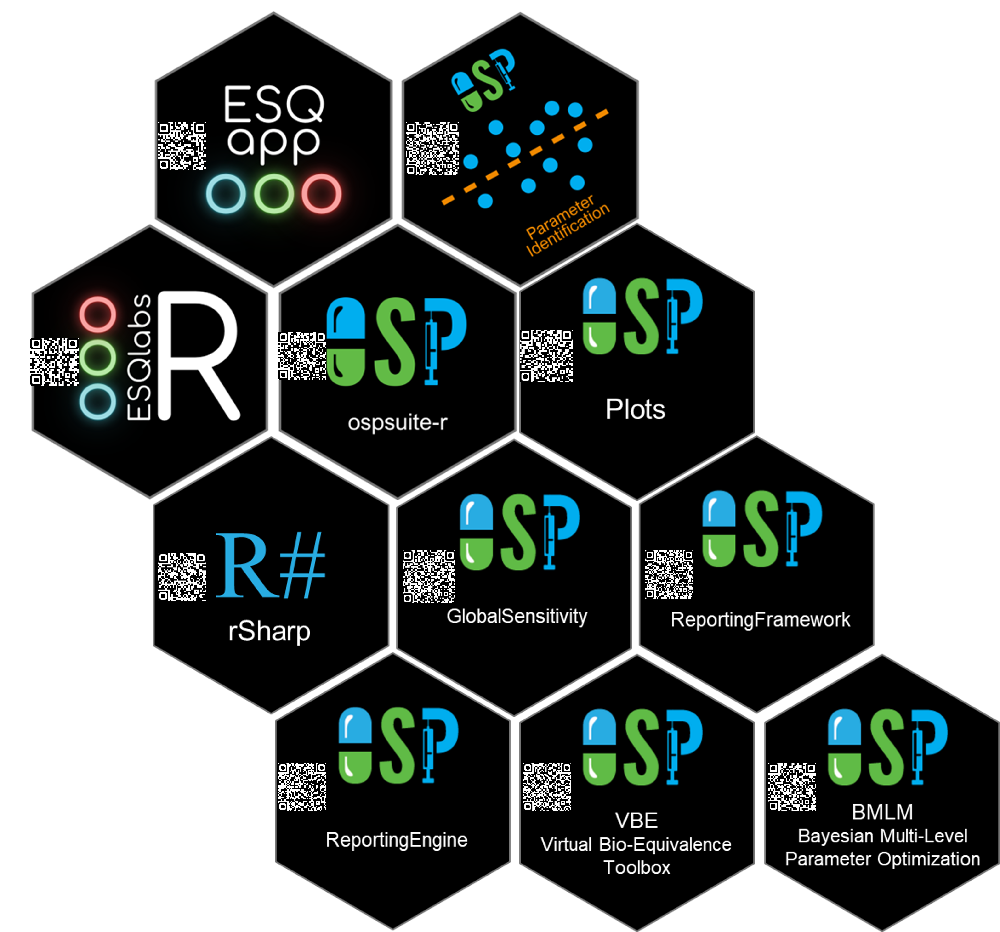
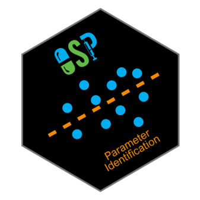
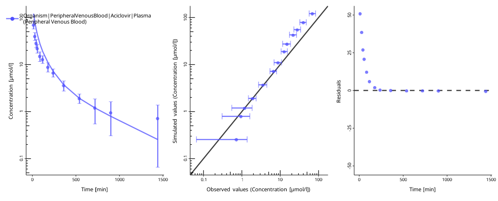
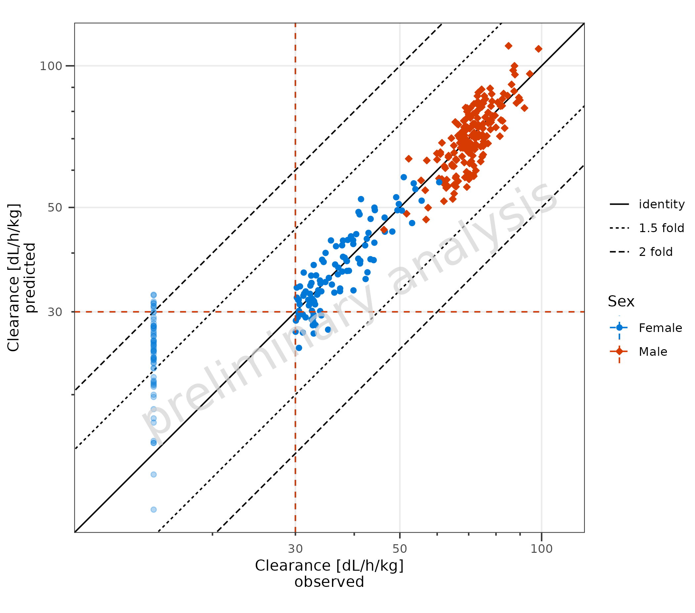
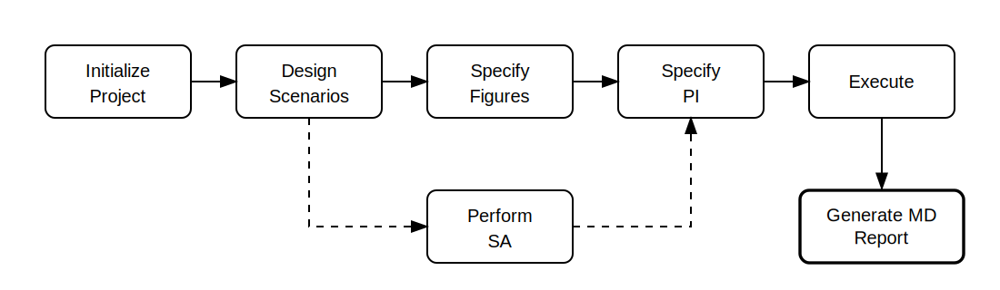

```{r setup, include=FALSE}
library(ospsuite)
if (requireNamespace("showtext", quietly = TRUE)) {
  showtext::showtext_auto(enable = FALSE)
}

ospsuite.plots::setDefaults()
ggplot2::theme_update(legend.title = ggplot2::element_blank())
options(ospsuite.plots.watermarkEnabled = FALSE)
knitr::opts_chunk$set(fig.align = "center", out.width = "70%")
simFilePath <- system.file("extdata", "Aciclovir.pkml", package = "ospsuite")
sim <- loadSimulation(simFilePath)
```

# Welcome 👋 {background-color="#1a4d8f"}

## PAGE 2026 — Workshop Day 1

::: {.r-fit-text}
**R Workflows for advanced PB-QSP Modeling**

with `{ospsuite}` and `{esqlabsR}`
:::

::: {.center-x}
{height=100 fig-align="center"}

2026-06-01 · Valamar Lacroma, Dubrovnik · 09:00 – 17:00

Pavel Balazki · Dr. Wilbert de Witte

:::

## Who we are

:::: {.columns}
::: {.column width="50%"}
**Pavel Balazki**

- Teamlead Software Development, ESQlabs
- Senior Scientist, focus on QSP disease modeling
- 10+ years PBPK in OSPS
:::
::: {.column width="50%"}
**Wilbert de Witte**

- _[bio placeholder — Wilbert to fill]_
- Will roam the room, debug your hands-on, and answer your questions
:::
::::

## Why are you here?

::: {.incremental}
- You know **PK-Sim / MoBi**. You can build a model, run a simulation, analyze the results.
- But your project requires:
  - Reproducibility for QC/audit
  - Dozens of simulation scenarios + parameter sweeps
  - Sensitivity analyses at scale
  - Reports a regulator can re-run from raw inputs
- The GUI alone won't get you there.
:::

. . .

::: {.center-x .r-fit-text}
**Today: bridge from GUI click to reproducible Quarto report.**
:::

## The problem we solve today {background-color="#1a4d8f"}

:::: {.columns}
::: {.column width="28%"}
::: {.center-x}
[Model (GUI click)]{style="color:white;"}
:::
{height=110 fig-align="center"}

{height=110 fig-align="center"}
:::

::: {.column width="6%"}
::: {.center-x style="font-size:3em; color:white; padding-top:1.5em;"}
→
:::
:::

::: {.column width="26%"}
::: {.center-x}
[R workflow (code)]{style="color:white;"}
:::
{height=130 fig-align="center"}

{height=130 fig-align="center"}
:::

::: {.column width="6%"}
::: {.center-x style="font-size:3em; color:white; padding-top:1.5em;"}
→
:::
:::

::: {.column width="28%"}
::: {.center-x}
[Regulatory report (re-render)]{style="color:white;"}
:::

<br><br><br><br>

{fig-align="center" style="background:white"}
:::
::::

. . .

::: {.center-x style="color:white;"}
One-click rendering. Re-runnable. Version-controlled. Auditable.
:::

# 📅 Today's roadmap {background-color="#1a4d8f"}

## Agenda — at a glance

| Time | Block | Topic |
|---|---|---|
| 09:00–09:30 | 0 | Welcome + setup + skill poll |
| 09:30–10:30 | 1 | `{ospsuite}` foundations — load + inspect |
| 10:30–10:45 | ☕ | Break |
| 10:45–12:30 | 2 | Parameterize · Run · Plot |
| 12:30–13:30 | 🍽 | Lunch |
| 13:30–14:00 | 3 | PK params · Sensitivity · Populations |
| 14:00–15:00 | 4 | `{esqlabsR}` project workflow |
| 15:00–15:15 | ☕ | Break |
| 15:15–16:30 | 5 | Advanced SA · Param ID demo |
| 16:30–17:00 | 6 | Quarto reporting + close |

## Format

- ~60% demo / ~40% hands-on
- Two compounds:
  - **Aciclovir** (morning, simple PK)
  - **Midazolam–CYP3A** (afternoon, regulatory-style project)
- All materials online: `https://esqlabs.github.io/PAGE2026-R-WORKSHOP/`

## 🎯 Learning objectives

::: {.incremental}
1. **Load & manipulate** PK-Sim models from R using `{ospsuite}`
2. **Run & plot** simulations programmatically
3. **Compute** PK parameters and **sensitivity** indices
4. **Structure** a reproducible project with `{esqlabsR}`
5. **Generate** publication-/submission-ready Quarto reports
6. Know **which package** to reach for and **why**
:::

## Prerequisites — let's check

::: {.incremental}
- Basic R (you have written a script before)
- Familiar with PK-Sim / MoBi (built or used a PBPK model)
- Today we will **NOT** cover PBPK fundamentals
:::

. . .

## 🖐️ Show of hands — your R level

Pick the line that best describes you:

::: {.incremental}
1. Never used R
2. Followed a tutorial
3. Write scripts for my work
4. Comfortable with tidyverse + debugging
5. I write R packages
:::

::: {.notes}
INSTRUCTOR: count hands per level. If mean ≥ 3, skip the optional R refresher (next 2 slides). Otherwise spend 15–20 min on the refresher and on RStudio orientation.
:::

# 🛠️ Setup check {background-color="#1a4d8f"}

## Azure VM login

1. Open the email "PAGE 2026 — your VM credentials"
2. Click the link → browser RDP
3. Username + password from the email

. . .

## Open the project in RStudio

1. Open **RStudio** (link on the desktop)
2. **File → New Project → Existing Directory**
3. Select the **Midazolam-PAGE** folder on the Desktop

. . .

## Sanity check (run in RStudio console)

```{r}
library(ospsuite)
library(esqlabsR)
sim <- loadSimulation(system.file(
  "extdata",
  "Aciclovir.pkml",
  package = "ospsuite"
))
sim
```

If you see a simulation summary → ✅ ready for the day.

## Optional: 20-min R refresher

::: {.incremental}
- RStudio panes: editor / console / environment / files-plots-help
- Run a line: `Ctrl+Enter` · Run a script: source button
- `<-` is assignment; `%>%` / <code>|&gt;</code> is the pipe
- Install/load: `install.packages()` / `library()`
- Get help: `?function_name`
- `here::here()` for portable paths
:::

## R concepts in 60 seconds

::: {.incremental}
- **Variable** — named container for a value; created with `x <- 5` (read "x gets 5").
- **Function** — reusable operation; called with `name(args)`, returns a value.
- **Argument** — input to a function; passed by position `mean(c(1,2))` or by name `mean(x = c(1,2), na.rm = TRUE)`.
- **Package** — bundle of functions + data; loaded with `library(pkg)`, called as `pkg::fn()`.
:::

## Tidyverse highlights

::: {.incremental}
- `dplyr::filter(df, x > 0)` — keep rows where the condition is true.
- `dplyr::mutate(df, new = old * 2)` — add or overwrite columns.
- `dplyr::select(df, a, b)` — pick columns by name.
- `dplyr::summarise(df, m = mean(x))` — collapse rows into one summary row (use with `group_by`).
- `ggplot2::ggplot(df, aes(x, y)) + geom_point()` — build a plot layer by layer.
:::

# Block 1 — `{ospsuite}` foundations {background-color="#2d6e3a"}

## Goal of Block 1

::: {.r-fit-text}
**Load an OSP model in R · inspect its structure · save it back.**
:::

## The OSP R-package ecosystem

{fig-align="center" height="500"}

::: {.notes}
Walk through the diagram: `ospsuite` for model manipulation, `esqlabsR` for project structure, `ospsuite.parameteridentification` for fitting, `ospsuite.reportingengine` for qualification reports.
:::

# 👥 User-Oriented Packages {.center background-color="#2d6e3a"}

## User-Oriented Packages

::: {layout-ncol="4"}



:::

## `{ospsuite}`

::: columns
::: {.column width="40%"}
{fig-align="left"}
:::

::: {.column width="60%"}
**Main R interface with OSP Suite**

- Load, Manipulate and Run Simulations
- Shares the same simulation "Core" as PK-Sim and MoBi
- Perform PK parameter calculations
- Perform sensitivity analysis
- Create standard plots
:::
:::

## `{esqlabsR}`

::: columns
::: {.column width="40%"}
{fig-align="left"}
:::

::: {.column width="60%"}
**Tailor-Made Interface to OSPSuite R**

- Excel-Driven Simulation Design — from scenario creation to automated reporting
- Enforced Reproducibility — scenario-based workflow
- Standardized Visualization
- Advanced Sensitivity Analysis
- Parameter Identification
- GUI for interactive use (ESQapp)
:::
:::

## `{ospsuite.parameteridentification}`

::: columns
::: {.column width="40%"}
{fig-align="left"}
:::

::: {.column width="60%"}
**Estimate model parameters from observed data**

- Parameter estimation with different optimization algorithms
- Confidence-interval estimation
- Custom cost functions
- Standardized visualization of results

{fig-align="center"}
:::
:::

## `{ospsuite.plots}`

::: columns
::: {.column width="40%"}
{fig-align="left" width="337"}
:::

::: {.column width="60%"}
**Figures and tables generation**

- Generation of standard figures
- `{ggplot2}`-based plotting functions

{fig-align="center"}
:::
:::

## `{ospsuite}` — what it does

::: {.incremental}
- Loads `.pkml` simulation files into memory
- Exposes parameters, molecules, compartments as R objects
- Runs simulations (single or batch, parallel)
- Returns time–concentration (or other model outputs) arrays
- Computes PK parameters and sensitivity indices
- Plots (ggplot2-based)
:::

## R6 reference semantics

`{ospsuite}` uses **R6** classes. Reference semantics mean:

```{.r}
sim2 <- sim         # NOT a copy — same object
setParameterValuesByPath("Liver|Volume", 2, sim)
sim2  # also changed!
```


## Working With R6 Objects

Access fields/methods with `$`; construct with `ClassName$new()`:

```{.r}
sim$solver
sim$outputSelections

dc <- DataCombined$new()
dc$addSimulationResults(
  simulationResults = simulationResults,
  quantitiesOrPaths = outputPath
)
```

Practical rules:

- `setParameterValues()`, `addOutputs()`, `clearOutputs()`, `addOutputInterval()` **mutate** their argument — no reassignment
- `reset()` on a parameter restores its pkml default without reloading
- Fresh independent state: call `loadSimulation(path)` again


## The 7-step `{ospsuite}` workflow

1. **Load** simulation
2. **Inspect** parameters / molecules / outputs
3. **Modify** parameters
4. **Run** simulation
5. **Extract** results
6. **Analyze** (PK, SA)
7. **Plot**

::: {.center-x .fragment}
Today we walk all 7 steps with an example of Aciclovir PBPK model.
:::

## Loading a simulation

```{r}
library(ospsuite)

# bundled with the package
sim_path <- system.file("extdata", "Aciclovir.pkml", package = "ospsuite")
sim <- loadSimulation(sim_path)

print(sim)
```

## Inspect the simulation

Once loaded, the `sim` object exposes its configuration as fields:

```{r}
sim$solver # solver tolerances + step bounds
sim$outputSelections # which quantities are recorded
sim$outputSchema # simulation time + output intervals
```

::: {.notes}
Walk through each field on screen — point out `absTol`, `relTol`, `mxStep` in solver; show which compartments will be in the result; show start/end time + resolution.
:::

## Parameter paths — the addressing system

Every parameter, molecule, container in the simulation is addressed by a **path**:

```
Organism | Liver | Interstitial | Volume
^         ^       ^              ^
container container container    parameter
```

- Hierarchical, `|`-delimited
- Each layer = a **container**; last element = parameter / molecule amount / observer
- Same syntax for molecules: `Organism|VenousBlood|Plasma|Aciclovir`

## Simulation tree — explore interactively

`getSimulationTree(sim)` returns a navigable list tree of every path in the model. Best way to **discover** what's in a model.

```{r}
tree <- getSimulationTree(sim)

# tab-complete from RStudio: tree$Organism$Liver$Interstitial$Volume
tree$Organism$PeripheralVenousBlood$Aciclovir$`Plasma (Peripheral Venous Blood)`
```

::: {.center-x .fragment}
**Demo live in RStudio:** tab-complete from `tree$` and watch the model unfold.
:::

## Get one parameter — `getParameter()`

```{r}
p <- getParameter("Organism|Liver|Interstitial|Volume", sim)
p$value # numeric value in base unit
p$unit # display unit (e.g. "L")
p$dimension # "Volume"
```

. . .

Short paths work too if you pass a sub-container as the second arg:

```{r}
liver <- getContainer("Organism|Liver", sim)
getParameter("Interstitial|Volume", liver)
```

## Find paths by pattern — `getAllParametersMatching()`

Wildcards: `*` = exactly one path element, `**` = any number of elements.

```{r}
# all parameters named "Volume" anywhere in the model
head(getAllParametersMatching("**|Volume", sim), 3)

# all "Volume" parameters in compartments named "Interstitial"
# with exactly one container between Organism and Interstitial
head(getAllContainersMatching("Organism|*|Interstitial", sim), 3)

# all parameter paths under Liver (no wildcards needed)
getAllParameterPathsIn(liver)[1:5]
```

::: {.notes}
Demo each on screen. Bridge to hands-on: attendees explore Liver + find a Volume parameter.
:::

## 🖐️ Hands-on 1 — explore the model (15 min)

Open `exercises/PAGE_2026/block1.R` in RStudio. Tasks:

1. Load the bundled `Aciclovir.pkml`
2. Build the simulation tree with `getSimulationTree(sim)`
3. Tab-complete from `tree$Organism$...` — find the Liver volume parameter
4. Use `getParameter()` to read its value, unit, and dimension
5. Use `getAllParametersMatching("**|Volume", sim)` to list every Volume in the model

::: {.center-x}
⏰ **15 min** · Wilbert is in the room — flag him over for blockers
:::

::: {.notes}
Solutions in `exercises/PAGE_2026/solutions/block1.R`. Common gotchas: forgetting `system.file`, escaping `|` in regex (don't — these are not regex), confusing `*` and `**` wildcards.
:::

## ☕ Break — 15 min

::: {.center-x .r-fit-text}
**See you at 10:45** for Parameterize · Run · Plot.

_(replace this slide with the right time on the day)_
:::

# Block 2 — Parameterize · Run · Plot {background-color="#2d6e3a"}

## Goal of Block 2

::: {.r-fit-text}
**Modify parameters · run · compare simulation vs observed data.**
:::

## What can be changed

Once a `.pkml` model is loaded in `{ospsuite}`, you can change from R:

::: {.incremental}
- **Parameters** (accessed by path)
- **Output paths** (which quantities are recorded)
- **Simulation time** + output intervals
- **Solver settings** (tolerances, step bounds)
:::

. . .

::: {.center-x}
We'll touch all four. Parameters first.
:::

# Parameter values {.center background-color="#2d6e3a"}

## Set a parameter value

```{r}
ageParam <- getParameter("Organism|Age", sim)
ageParam
```

. . .

```{r}
setParameterValues(ageParam, 55, units = "year(s)")
ageParam
```

::: {.callout-warning}
Always pass `units`. Base units (`kg`, `L`, `mol`) often differ from display units (`g`, `mL`, `µmol`).
:::

## Set values by path — shortcut

`setParameterValuesByPath()` combines `getParameter()` + `setParameterValues()` in one call. Accepts a single path or a vector.

```{r}
setParameterValuesByPath(
  parameterPaths = c("Organism|Age", "Organism|Weight"),
  values = c(40, 75),
  units = c("year(s)", "kg"),
  simulation = sim
)
```

## Reset parameter values

Restore the `.pkml` default with `$reset()` — no need to reload the simulation.

```{r}
ageParam$reset()
ageParam
```

# Simulation outputs {.center background-color="#2d6e3a"}

## Change simulation outputs

Defaults come from the imported `.pkml`:

```{r}
sim$outputSelections
```

. . .

Add another output with `addOutputs()`:

```{r}
addOutputs(
  "Organism|PeripheralVenousBlood|Aciclovir|Whole Blood (Peripheral Venous Blood)",
  simulation = sim
)

sim$outputSelections
```

# Simulation time {.center background-color="#2d6e3a"}

## Change simulation time

Default simulation time comes from the `.pkml`:

```{r}
sim$outputSchema
```

## Add an output interval

`addOutputInterval()` adds a new interval to the output schema (in minutes).

```{r}
addOutputInterval(
  simulation = sim,
  startTime = 1440,
  endTime = 1500,
  resolution = 2,
  intervalName = "highResEndSim"
)
sim$outputSchema
```

## Clear and replace intervals

```{r}
clearOutputIntervals(simulation = sim)
sim$outputSchema

# add a new global interval
addOutputInterval(
  simulation = sim,
  startTime = 0,
  endTime = 1440,
  resolution = 0.5,
  intervalName = "globalRes"
)
sim$outputSchema
```

# Solver settings {.center background-color="#2d6e3a"}

## Inspect solver settings

Numerical solver tolerances + step-size limits live in `sim$solver`. Tighter tolerances → more accurate but slower; loosen only if runtime is prohibitive **and** accuracy loss is acceptable.

```{r}
sim$solver
```

## Change solver settings

Solver fields are writable directly. Typical knobs: `absTol`, `relTol`, `h0` (initial step), `hMin` / `hMax` (step bounds), `mxStep` (max internal steps).

```{r}
sim$solver$absTol <- 1e-10
sim$solver$relTol <- 1e-9
sim$solver
```

# Running simulations {.center background-color="#2d6e3a"}

## runSimulations

Runs one or many simulations and returns a **named list of `SimulationResults`**, keyed by each simulation's **ID** (`sim$id`).

```{r}
res_list <- runSimulations(sim)
names(res_list) # the simulation IDs
res <- res_list[[1]] # or: res_list[[sim$id]]
res
```

. . .

::: {.callout-note}
**Always a list, even for one simulation.** Don't forget `[[1]]` (or look up by `sim$id`) to get the actual `SimulationResults` object.
:::

## Running many simulations

Pass a list of simulations — same return shape, one entry per input.

```{.r}
# CAUTION: do NOT use sim$clone() — ospsuite R6 wraps a .NET object;
# $clone() does not produce an independent simulation. Reload the .pkml instead.
sim_250 <- loadSimulation(simFilePath)
sim_500 <- loadSimulation(simFilePath)

setParameterValuesByPath("Applications|...|Dose", 250, sim_250, units = "mg")
setParameterValuesByPath("Applications|...|Dose", 500, sim_500, units = "mg")

results <- runSimulations(list(sim_250, sim_500))
names(results)               # IDs of sim_250 and sim_500
```

## Extracting results

`getOutputValues()` pulls time + numeric values out of a `SimulationResults` object as a data frame.

```{r}
outputPath <- "Organism|PeripheralVenousBlood|Aciclovir|Plasma (Peripheral Venous Blood)"

out <- getOutputValues(res, quantitiesOrPaths = outputPath)

head(out$data) # → time + one column per output path
```

## `simulationResultsToDataFrame()`

Convenience flattener: simulation values + metadata in a single `data.frame`.

```{r}
df <- simulationResultsToDataFrame(res)
head(df)
```

. . .

::: {.center-x}
Use this when you want one tidy data frame instead of `out$data` + `out$metaData` separately.
:::

## Control execution — `SimulationRunOptions`

`runSimulations()` accepts a `simulationRunOptions` argument built with `SimulationRunOptions$new()`. Tune parallelism, progress bar, and value checks.

```{.r}
opts <- SimulationRunOptions$new(
  numberOfCores         = 4,    # parallel across cores
  showProgress          = TRUE, # progress bar
  checkForNegativeValues = TRUE
)

results <- runSimulations(
  simulations          = list(sim_250, sim_500),
  simulationRunOptions = opts
)
```

::: {.callout-tip}
Parallel scaling is near-linear up to physical core count. Worth it when running many sims or populations; pure overhead for a single short sim.
:::

## Save + load results — CSV

`exportResultsToCSV()` saves `SimulationResults` to disk. `importResultsFromCSV()` reads it back. Useful for slow simulations, sharing with colleagues, or later processing.

```{.r}
# write
exportResultsToCSV(res, "aciclovir_results.csv")

# read back (needs the original Simulation object)
res_loaded <- importResultsFromCSV(sim, "aciclovir_results.csv")
```

::: {.callout-note}
Re-import requires the same `Simulation` object that produced the results — the CSV stores values but not the model structure.
:::

# Plotting {.center background-color="#2d6e3a"}

## Two building blocks

::: {.incremental}
- **`DataSet`** — container for **observed** data (manual entry, `.pkml`, Excel)
- **`DataCombined`** — links **simulated** + **observed** data for plotting
:::

. . .

::: {.center-x .fragment}
`{ospsuite.plots}` reads `DataCombined` → returns `ggplot2` objects.
:::

## `DataSet` — create

Each `DataSet` must be **named** at construction.

```{r}
dataSet <- DataSet$new("Aciclovir manual")
dataSet$setValues(
  xValues = c(1, 2, 3, 4),
  yValues = c(0, 0.1, 0.6, 10),
  yErrorValues = c(0.001, 0.001, 0.1, 1)
)
dataSetToTibble(dataSet)
```

## `DataSet` — load from `.pkml`

```{r}
obs <- loadDataSetFromPKML(
  system.file("extdata", "ObsDataAciclovir_1.pkml", package = "ospsuite")
)
dataSetToTibble(obs) |> head()
```

. . .

Excel: `loadDataImporterConfiguration()` + `loadDataSetsFromExcel()` — see A6 for the full pattern.

## `DataCombined` — assemble

```{r}
dc <- DataCombined$new()

dc$addSimulationResults(
  simulationResults = res,
  quantitiesOrPaths = outputPath,
  names = "Simulated",
  groups = "Aciclovir"
)

dc$addDataSets(
  obs,
  names = "Observed",
  groups = "Aciclovir"
)

dc$toDataFrame() |> head()
```

## Five plot types — overview

`{ospsuite.plots}` provides:

| Function | Purpose |
|---|---|
| `plotTimeProfile()` | time profiles (sim + obs) |
| `plotPredictedVsObserved()` | goodness of fit |
| `plotResidualsVsCovariate()` | residuals vs time or predicted |
| `plotResidualsAsHistogram()` | residuals distribution |
| `plotQuantileQuantilePlot()` | residuals normality (Q-Q) |

All return **`ggplot2` objects** — customize with `+`.

## Time profile

```{r}
plotTimeProfile(dc)
```

## Time profile — log y

Plasma profiles read better on log scale.

```{r}
plotTimeProfile(dc, yScale = "log")
```

## Predicted vs observed

```{r}
plotPredictedVsObserved(dc)
```

## Residuals vs time

```{r}
plotResidualsVsCovariate(dc, xAxis = "time")
```

## Residuals vs predicted

```{r}
plotResidualsVsCovariate(dc, xAxis = "predicted")
```

## Residuals — histogram

```{r}
plotResidualsAsHistogram(dc)
```

## Residuals — Q-Q

```{r}
plotQuantileQuantilePlot(dc)
```

## Customize — `ggplot2` layers

All plots are `ggplot2` objects. Add layers with `+`.

```{r}
library(ggplot2)
plotTimeProfile(dc) +
  labs(
    title = "Aciclovir — single dose",
    subtitle = "Sim vs obs (Vergin 1995)",
    caption = "OSPS R training"
  ) +
  theme_minimal()
```

## Multi-panel — `{patchwork}`

`|` side-by-side · `/` stacked.

```{r}
library(patchwork)
tp <- plotTimeProfile(dc)
rt <- plotResidualsVsCovariate(dc, xAxis = "time")
rp <- plotResidualsVsCovariate(dc, xAxis = "predicted")

(tp | rp) / rt + plot_annotation(title = "Aciclovir diagnostics")
```

## Save a plot — `exportPlot()`

```{.r}
p <- plotTimeProfile(dc)

ospsuite.plots::exportPlot(
  plotObject = p,
  filePath   = "aciclovir_timeprofile.png",
  width      = 20,   # cm
  height     = NULL, # auto from aspect ratio
  dpi        = 300
)
```

::: {.callout-note}
Returns plain `ggplot2` — also works with `ggplot2::ggsave()`, but `exportPlot()` handles OSP house style + sizing in cm.
:::

## 🖐️ Hands-on 2 — knock out renal clearance (30 min)

Compare default Aciclovir vs. a "no GFR" variant. Open `exercises/PAGE_2026/block2.R`.

1. Load Aciclovir twice — `sim` (default) + `sim_noGFR`
2. In `sim_noGFR`, set **GFR fraction to 0** at
   `Neighborhoods|Kidney_pls_Kidney_ur|Aciclovir|Glomerular Filtration-GFR-Aciclovir|GFR fraction`
3. `runSimulations(list(sim, sim_noGFR))` → two `SimulationResults`
4. Build a `DataCombined` with both sims + observed data from `ObsDataAciclovir_1.pkml`
5. `plotTimeProfile(dc, yScale = "log")` — compare profiles
6. **Bonus:** `plotResidualsVsCovariate(dc, xAxis = "time")`

::: {.center-x}
⏰ **30 min** · Solutions in `exercises/PAGE_2026/solutions/block2.R`
:::

::: {.notes}
Talking point: removing renal clearance ≈ doubling AUC for Aciclovir (drug is ~80% renally cleared). Mechanistic demo of clearance-pathway knock-out — bridge to Block 5 SA story.
:::

## 🍽️ Lunch — 60 min

::: {.center-x .r-fit-text}
**See you at 13:30** for PK params + sensitivity.

_(replace this slide with the right time on the day)_
:::

# Block 3 — PK · Sensitivity · Populations {background-color="#2d6e3a"}

## Goal of Block 3

::: {.r-fit-text}
**Compute PK parameters · run a sensitivity analysis · run population simulations.**
:::

## Calculating PK parameters

```{r}
pk <- calculatePKAnalyses(res)

pkAnalysesAsDataFrame(pk) |>
  dplyr::select(QuantityPath, Parameter, Value, Unit) |>
  head(8)
# AUC_inf, C_max, t_max, t_half, ...
```

. . .

Custom PK params: `addUserDefinedPKParameter()`.

## Local sensitivity analysis

Build a `SensitivityAnalysis` object → vary the listed parameters → run.

```{r}
gfrPath <- "Neighborhoods|Kidney_pls_Kidney_ur|Aciclovir|Glomerular Filtration-GFR-Aciclovir|GFR fraction"

sa <- SensitivityAnalysis$new(
  simulation = sim,
  parameterPaths = c("Aciclovir|Lipophilicity", gfrPath)
)
sa$variationRange <- 0.1 # ±10 %

saResult <- runSensitivityAnalysis(sa)
```

## Top influencers — per PK parameter

```{r}
plasmaPath <- "Organism|PeripheralVenousBlood|Aciclovir|Plasma (Peripheral Venous Blood)"

saResult$allPKParameterSensitivitiesFor(
  pkParameterName = "AUC_inf",
  outputPath = plasmaPath,
  totalSensitivityThreshold = 1 # show all (default 0.9 hides minor)
)
```

::: {.center-x .fragment}
Sensitivity = $\dfrac{\Delta Y / Y}{\Delta X / X}$ — value `1` means proportional, `-1` means inverse.
:::

::: {.notes}
Briefly contrast with the `{esqlabsR}` multi-range SA we'll see in Block 5 — same engine, richer interface.
:::

## 🖐️ Hands-on 3 — local SA (15 min)

Open `exercises/block3.R`. Tasks:

1. Run a local SA on Aciclovir for `Lipophilicity` and `GFR_filtration_fraction`
2. Identify the top driver of `AUC_inf`
3. Repeat with `variationRange = 0.5` — does the ranking change?

::: {.center-x}
⏰ **15 min**
:::

## Demo only — virtual individuals

```{.r}
ind_chars <- createIndividualCharacteristics(
  species = Species$Human, population = HumanPopulation$European_ICRP_2002,
  age = 35, weight = 75, height = 175, gender = Gender$Male
)
ind_params <- createIndividual(individualCharacteristics = ind_chars)
setParameterValuesByPath(ind_params$distributedParameters$paths,
                         ind_params$distributedParameters$values, sim)
```

## Demo only — populations

```{.r}
pop_chars <- createPopulationCharacteristics(
  species = Species$Human, population = HumanPopulation$European_ICRP_2002,
  numberOfIndividuals = 50, weightMin = 60, weightMax = 90
)
pop <- createPopulation(populationCharacteristics = pop_chars)$population

results_pop <- runSimulations(sim, population = pop)[[1]]
```

::: {.center-x}
Full hands-on in modules **A12** + **A13** of the repo.
:::

# Block 4 — `{esqlabsR}` project workflow {background-color="#8f4d1a"}

## Goal of Block 4

::: {.r-fit-text}
**Move from "scripts in a folder" to a regulatory-grade, Excel-driven project.**
:::

## Switch compound — Midazolam

::: {.incremental}
- CYP3A4-mediated metabolism
- Classic DDI victim drug (with ketoconazole / itraconazole)
- Public PK data for IV + PO routes
- Real-world target for an M&S submission package
:::

. . .

::: {.center-x}
**Use case for the rest of the day:** assemble a Midazolam M&S project that survives a regulatory audit.
:::

## Why `{esqlabsR}`

| Need | `{ospsuite}` only | `{esqlabsR}` |
|---|---|---|
| Run 1 sim | ✅ | ✅ |
| 50 scenarios with traceable parameter overrides | hard | ✅ |
| GUI-supported, non-coder-friendly | ❌ | ✅ |
| One-line "rebuild everything" | ❌ | ✅ |

## `{esqlabsR}`'s Workflow

:::: {.columns}

::: {.column width="50%"}
1. Project Initialization (once per project)
2. Scenario Design
3. Specify Figures
4. Specify Parameter Identification (optional)
:::

::: {.column width="50%"}
5. Perform Sensitivity Analysis (optional)
6. Execute tasks
7. Generate Markdown Report
:::

{fig-align="center"}

::::

## Project structure

```
Midazolam-PAGE/
├── ProjectConfiguration.xlsx       ← master file
├── Models/
│   └── Simulations/
│       ├── Midazolam_PO_7.5mg.pkml
│       ├── Midazolam_PO_15mg.pkml
│       └── Midazolam_IV_2mg.pkml
├── Configurations/
│   ├── Scenarios.xlsx
│   ├── ModelParameters.xlsx
│   ├── Applications.xlsx
│   └── Plots.xlsx
├── Data/
│   └── Midazolam_obs.xlsx
├── Results/
└── Reports/
    └── Midazolam-report.qmd
```

## Initializing a project

```{.r}
library(esqlabsR)

initProject(path = "~/Workshop/Midazolam-PAGE")
# → creates the skeleton above
```

. . .

Or use **"New Project"** in ESQapp — same skeleton, GUI-driven.

. . .

For today: skeleton is already on the VM at `~/Desktop/projects/Midazolam-PAGE`. Open it in RStudio.

## Scenarios.xlsx — the heart of the workflow

::: {.incremental}
- One row per scenario
- Columns: `Scenario`, `ModelFile`, `ApplicationProtocol`, `IndividualId`, `PopulationFile`, `OutputPathsId`, `SimulationTime`, ...
- `ModelParameters` references modify any parameter
- Hierarchy of overrides — explicit, traceable
:::

. . .

::: {.center-x}
ESQapp gives you a GUI to edit these — same files, friendlier UI.
:::

## 🖥️ Demo — open the project in ESQapp

::: {.r-fit-text}
**Switch to ESQapp.** Walk through the Midazolam-PAGE project definitions live.
:::

::: {.incremental}
- Open `Midazolam-PAGE/ProjectConfiguration.json` in ESQapp
- Tour the **Scenarios** sheet — model file, protocol, individual, outputs
- Open the linked **Applications**, **Individuals**, **ModelParameters** sheets
- Show the **Plots** sheet — DataCombined + plotConfiguration + plotGrids
- Edit one cell, save, observe the JSON snapshot diff
:::

::: {.notes}
INSTRUCTOR: switch to ESQapp window (second monitor). Demo 5–8 min — focus on how Excel rows + JSON snapshot mirror each other. Then return to deck for "Running scenarios".
:::

## Running scenarios

```{.r}
project <- createProjectConfiguration("ProjectConfiguration.xlsx")

# 1. Read the scenario config rows from Scenarios.xlsx
scenarioConfig <- readScenarioConfigurationFromExcel(
  scenarioNames        = c("Midazolam_PO_7.5mg", "Midazolam_IV_2mg"),
  projectConfiguration = project
)

# 2. Materialize Scenario objects (loads .pkml, applies parameters + protocol)
scenarios <- createScenarios(scenarioConfig)

# 3. Run them
results <- runScenarios(scenarios = scenarios)
```

::: {.callout-note}
Two-step: **`readScenarioConfigurationFromExcel`** parses Excel rows, **`createScenarios`** builds the in-memory `Scenario` objects from them.
:::

## Scenario Structure

```{mermaid}
%%| fig-align: center
flowchart LR
  S(["Scenario"])
  S --> NAME["scenarioName"]
  S --> MODEL["modelFile<br/>(.pkml)"]
  S --> APP["applicationProtocol<br/><i>Applications.xlsx</i>"]
  S --> PHYS["Physiology"]
  PHYS --> IND["individualId<br/><i>Individuals.xlsx</i>"]
  PHYS --> POP["populationId<br/><i>Populations.xlsx</i>"]
  S --> PARAM["paramSheets<br/><i>ModelParameters.xlsx</i>"]
  S --> OUT["outputPaths"]
  S --> TIME["Simulation time<br/>(start, end, resolution)"]
  S --> SS["Steady-state<br/>(optional)"]
```

::: {.center-x}
Each property maps to a row or sheet in the configuration Excel files.
:::

## 🖐️ Hands-on 4a — your first scenario (30 min)

Open the **Midazolam-PAGE** project in **ESQapp**. Build a new scenario from scratch:

1. **Create** a new scenario.
2. **Model file:** select `Midazolam_PO_7.5mg.pkml`.
3. **Administration protocol:** create a new protocol — set the **dose to 15 mg** (everything else as in the 7.5 mg protocol).
4. **Individual:** create a new individual — e.g. **Female, Black American** (pick the matching population).
5. **Simulation time:** two intervals — `0–2 h` at **60 pts/h**, then `2–24 h` at **10 pts/h**.
6. **Outputs:** add **`Concentration` of Midazolam in fat → intracellular**: `Organism|Fat|Intracellular|Midazolam|Concentration in container`.
7. Save; reload in R via `readScenarioConfigurationFromExcel` + `createScenarios`; run via `runScenarios`.
8. Access simulated results via `$outputValues`.

::: {.center-x}
⏰ **30 min** · Wilbert circulates
:::

## Parametrization Hierarchy

Parameters are applied top-to-bottom — later layers override earlier ones for the same path.

```{mermaid}
%%| fig-align: center
flowchart TB
  P1["<div style='text-align:center'><b>1. .pkml defaults</b><br/><i>simulation file</i></div>"]
  P2["<div style='text-align:center'><b>2. Individual</b><br/><i>Individuals.xlsx</i></div>"]
  P2a["<div style='text-align:center'><b>2.1 Physiology</b><br/><i>IndividualBiometrics sheet</i></div>"]
  P2b["<div style='text-align:center'><b>2.2 Parameters</b><br/><i>individual-specific sheet</i></div>"]
  P3["<div style='text-align:center'><b>3. Population</b><br/><i>Populations.xlsx / .csv</i></div>"]
  P4["<div style='text-align:center'><b>4. Model parameter sheets</b><br/><i>ModelParameters.xlsx</i><br/>all selected sheets merged;<br/>later sheets overwrite earlier ones</div>"]
  P5["<div style='text-align:center'><b>5. Application protocol</b><br/><i>Applications.xlsx</i></div>"]
  P6["<div style='text-align:center'><b>6. Custom parameters</b><br/><i>customParams</i> arg of <code>createScenarios()</code></div>"]
  P1 --> P2
  P2 --> P2a
  P2 --> P2b
  P2a --> P3
  P2b --> P3
  P3 --> P4 --> P5 --> P6
  classDef base fill:#eef,stroke:#557,text-align:center;
  classDef top  fill:#fde,stroke:#955,text-align:center;
  class P1 base
  class P6 top
```

::: {.callout-tip}
The final set of parameters applied to the `.pkml` is available on each scenario via `scenarios$<scenarioName>$finalCustomParams`.
:::

## Defining figures — Plots view

The **Plots** view in ESQapp has **3 sub-sheets**:

| Sub-sheet | Purpose |
|---|---|
| `DataCombined` | Link simulated results + observed data, define grouping |
| `plotConfiguration` | Plot type, axes, labels, units, scales |
| `plotGrids` | Combine plots into multi-panel figures |

. . .

`plotType` values: `individual`, `observedVsSimulated`, `residualsVsTime`, `residualsVsSimulated`.

## Generating the plots in R

Three-step: load observed data → (optionally) build `DataCombined` → render plots.

```{.r}
# After saving in ESQapp:
restoreProjectConfiguration(file.path(projectDir, "ProjectConfiguration.json"))

# 1. Load observed data from Data/*_TimeValuesData.xlsx
#    using the esqlabs ImporterConfiguration. Pick the sheets you need.
observedData <- loadObservedData(
  projectConfiguration = project,
  sheets               = c("Ahonen 1995", "Allonen 1981")
)

# 2. Optional: explicit DataCombined construction
myDataCombined <- createDataCombinedFromExcel(
  projectConfiguration = project,
  dataCombinedNames    = "Midazolam_PO",
  simulatedScenarios   = results,
  observedData         = observedData
)

# 3. Render plot grids
plots <- createPlotsFromExcel(
  plotGridNames        = "Midazolam_PO_vs_obs",
  simulatedScenarios   = results,
  observedData         = observedData,
  projectConfiguration = project
)

plots$Midazolam_PO_vs_obs
```

::: {.callout-note}
`loadObservedData()` reads the Excel files in `Data/` using `Data/esqlabs_dataImporter_configuration.xml`. One sheet → one named `DataSet`. Sheet names must match the `dataSet` cells in `DataCombined`.
:::

## Figures Structure

```{mermaid}
%%| fig-align: center
flowchart LR
  P(["Plots.xlsx"])
  P --> DC["DataCombined"]
  DC --> DCN["DataCombinedName"]
  DC --> DT["dataType"]
  P --> PC["plotConfiguration"]
  PC --> PID["plotID"]
  PC --> PT["plotType<br/>(individual / population /<br/>observedVsSimulated /<br/>residualsVsSimulated /<br/>residualsVsTime)"]
  PC --> AX["axes / scales / limits<br/>(optional)"]
  P --> PG["plotGrids"]
  PG --> GN["name"]
  PG --> GP["plotIDs"]
  PG --> GT["title"]
```

## 🖐️ Hands-on 4b — define a figure (20 min)

Stay in **ESQapp**. Tasks:

1. **Plots → DataCombined** → create `Midazolam_PO_15mg_DC` with 3 simulated rows:
   - `scenario = Midazolam_PO_15mg`, `path = Organism|PeripheralVenousBlood|Midazolam|Plasma (Peripheral Venous Blood)`, `group = PVB`, `label = Sim PVB`
   - `scenario = Midazolam_PO_15mg`, `path = Organism|Fat|Intracellular|Midazolam|Concentration in container`, `group = Fat`, `label = Sim Fat`
2. Add **observed** rows for the `PVB` group — pick obs dataset from `Data/Midazolam_obs.xlsx` (e.g. Backman 1994 placebo). Same `group = PVB` so sim + obs share legend, `label = Backman 1994` (or whatever the sheet name is).
3. **plotConfiguration** → 2 rows pointing at `Midazolam_PO_15mg_DC`:
   - `Midazolam_PO_15mg_profile`: `plotType = individual`, `yAxisScale = log`, `xUnit = h`
   - `Midazolam_PO_15mg_ResVsTime`: `plotType = residualsVsTime`, `xUnit = h`
4. **plotGrids** → `Midazolam_PO_15mg`, `plotIDs = Midazolam_PO_15mg_Time, Midazolam_PO_15mg_Res`
5. Save. In R: `restoreProjectConfiguration(...)`, `loadObservedData(...)`, `createPlotsFromExcel(plotGridNames = "Midazolam_PO_15mg", ...)`

::: {.center-x}
⏰ **20 min**
:::

## ☕ Break — 15 min

::: {.center-x .r-fit-text}
**See you at 15:15** for Advanced SA + Param ID demo.

_(replace this slide with the right time on the day)_
:::

# Block 5 — Advanced SA + Param ID demo {background-color="#8f4d1a"}

## Goal of Block 5

::: {.r-fit-text}
**Advanced sensitivity analysis · Parameter identification (demo).**
:::

## `{esqlabsR}` SA — what makes it "advanced"

::: {.incremental}
- Multi-factor `variationRange` (e.g. `0.1, 0.5, 1, 2, 10`) — reveals non-linear / saturation behaviour
- Custom output functions (any R function of `x` time / `y` output) beyond `C_max` / `t_max` / `AUC_inf`
- `saveSensitivityCalculation()` / `loadSensitivityCalculation()` — persist expensive runs
- Built-in **spider**, **tornado**, **time-profile** plots
:::

::: {.callout-note title="vs `{ospsuite}::sensitivityAnalysis()`"}
`{ospsuite}` does **local** SA — single perturbation per parameter, one index per `(parameter, PK metric)`.
:::

## SA workflow

```{mermaid}
flowchart LR
  A["readScenarioConfigurationFromExcel()"] --> B["createScenarios()"]
  B --> C["scenarios$X$simulation"]
  C --> D["sensitivityCalculation()"]
  D --> E1["sensitivitySpiderPlot()"]
  D --> E2["sensitivityTornadoPlot()"]
  D --> E3["sensitivityTimeProfiles()"]
```

## SA workflow in code

```{.r}
scenarios <- createScenarios(
  readScenarioConfigurationFromExcel(
    scenarioNames = "Midazolam_PO_7.5mg",
    projectConfiguration = project
  )
)
simulation <- scenarios$Midazolam_PO_7.5mg$simulation

outputPaths <- c(
  Plasma = "Organism|PeripheralVenousBlood|Midazolam|Plasma (Peripheral Venous Blood)"
)
parameterPaths <- c(
  Lipophilicity   = "Midazolam|Lipophilicity",
  CYP3A4_kcat     = "Midazolam-CYP3A4-Optimized|kcat",
  GFR_fraction    = "Neighborhoods|Kidney_pls_Kidney_ur|Midazolam|Glomerular Filtration-Optimized-Midazolam|GFR fraction"
)

analysis <- sensitivityCalculation(
  simulation     = simulation,
  outputPaths    = outputPaths,
  parameterPaths = parameterPaths,
  variationRange = c(0.1, 0.5, 1, 2, 10),
  pkParameters   = c("C_max", "t_max", "AUC_inf")
)

sensitivitySpiderPlot(analysis)
sensitivityTornadoPlot(analysis)
sensitivityTimeProfiles(analysis)
```

## Inspect + persist

```{.r}
head(analysis$pkData)
# cols: ParameterPath, ParameterFactor, ParameterValue,
#       PKParameter, PKParameterValue, PKPercentChange,
#       SensitivityPKParameter

saveSensitivityCalculation(analysis, outputDir = "Results/SA_Midazolam")

# later session — rebuild scenario, then:
analysis <- loadSensitivityCalculation(
  outputDir  = "Results/SA_Midazolam",
  simulation = simulation
)
```

## 🖐️ Hands-on 5 — Midazolam SA (20 min)

Tasks:

1. Build the scenario `Midazolam_PO_7.5mg`, pull `simulation <- scenarios$Midazolam_PO_7.5mg$simulation`
2. Define `outputPaths` (plasma) + `parameterPaths` (`Lipophilicity`, `CYP3A4_kcat`, `GFR_fraction`)
3. Run `sensitivityCalculation()` with `variationRange = c(0.1, 0.5, 1, 2, 10)` and `pkParameters = c("C_max", "AUC_inf")`
4. Render `sensitivitySpiderPlot()` + `sensitivityTornadoPlot()`
5. `saveSensitivityCalculation(analysis, outputDir = "Results/SA_Midazolam")` — Block 6 report reads it back

::: {.center-x}
⏰ **20 min**
:::

## Demo only — Parameter Identification

```{.r}
library(ospsuite.parameteridentification)

pi_task <- ParameterIdentification$new(
  simulations = list(sim_250, sim_500),
  parameters = list(
    PIParameter$new(parameterPaths = "Aciclovir|Lipophilicity",
                    simulations = list(sim_250, sim_500)),
    PIParameter$new(parameterPaths = "Aciclovir|...|GFR_filtration_fraction",
                    simulations = list(sim_250, sim_500))
  ),
  outputMappings = list(/* sim ↔ obs mappings */),
  configuration = PIConfigurationLeastSquares$new(algorithm = "BOBYQA")
)

result <- pi_task$run()
plot(result)
```

::: {.center-x .fragment}
Full hands-on in **C1** of the repo.
:::

## Param ID — what to know

::: {.incremental}
- Algorithms: BOBYQA (smooth), HJKB (robust), DEoptim (global)
- Objective functions: least-squares (homoscedastic) or M3 (BLOQ-aware)
- CIs: Hessian (cheap), profile likelihood (rigorous), bootstrap (gold standard)
- **Identifiability** is the hard problem — check OFV profiles before you trust your fit
:::

# Block 6 — Quarto reporting + close {background-color="#8f4d1a"}

## Goal of Block 6

::: {.r-fit-text}
**One-button regulatory report from your project.**
:::

## Quarto in 90 seconds

- Markdown + R/Python code chunks
- Renders to **HTML / PDF / Word / reveal.js / docx**
- Parameters: `params:` in YAML → re-render with new inputs
- Caching, citations, cross-refs, equations — all built in

## A reproducible M&S report

```yaml
---
title: "Midazolam PBPK — Single Dose"
params:
  dose_mg: 7.5
  route: "PO"
format:
  html: default
  pdf:
    documentclass: scrreprt
---
```

```{.r}
# in a chunk — runs scenarios + builds figures + tables
project        <- createProjectConfiguration("ProjectConfiguration.xlsx")
scenarioConfig <- readScenarioConfigurationFromExcel(/* picks scenario from params$dose_mg */)
scenarios      <- createScenarios(scenarioConfig)
results        <- runScenarios(scenarios)
```

## What goes in the report

1. **Background + objectives** (markdown)
2. **Model description** (auto-tabulated from `Models/`)
3. **Scenario specs** (auto-table from `Scenarios.xlsx`)
4. **Simulation results** (figure grid via `createPlotsFromExcel`)
5. **PK parameters** (auto-table via `calculatePKAnalyses`)
6. **Sensitivity summary** (load from `Results/SA_*.rds`)
7. **Conclusions** (markdown)

. . .

::: {.center-x}
**Re-render with `quarto render -P dose_mg:15` → fresh PDF.**
:::

## 🖐️ Hands-on 6 — re-render the report (10 min)

Tasks:

1. Open `Reports/Midazolam-report.qmd`
2. Render with default params: `quarto render` → opens HTML
3. Re-render with `dose_mg = 15`: `quarto render Reports/Midazolam-report.qmd -P dose_mg:15`
4. Compare the two PDFs — observe the figure regeneration

::: {.center-x}
⏰ **10 min**
:::

# 🎁 Closing {background-color="#1a4d8f"}

## What you can do now

::: {.incremental}
- Load + manipulate any PK-Sim model in R
- Run batches of simulations with traceable parameter overrides
- Compute PK + sensitivity, generate publication figures
- Structure a regulatory-grade M&S project
- Re-render a Quarto report end-to-end from raw inputs
:::

## Take-home

- 📦 **GitHub repo** — `github.com/esqLABS/r-packages-training`
  - All slides, exercises, solutions
  - The Aciclovir + Midazolam projects
- 📄 **Cheatsheet** (in your folder)
- 🎓 **Certificate of completion** (PDF — emailed tonight)

## What we did NOT cover (and where to find it)

| Topic | See |
|---|---|
| Population simulations (full hands-on) | `workshops/A12.qmd`, `A13.qmd` |
| Parameter identification (full hands-on) | `workshops/C1.qmd` |
| `{ospsuite.reportingengine}` qualification | OSPS docs |

## 🖐️ Final feedback — show of hands

**Would you recommend this workshop to a colleague?**

::: {.incremental}
- 👍 Yes, definitely
- 🤔 Maybe — with changes
- 👎 No
:::

. . .

**One thing to add / change next year?** — call out a word, we will write it on the board.

::: {.notes}
INSTRUCTOR: count hands per option, then go around the room for one-word suggestions. Capture on flipchart for post-workshop notes. Email follow-up survey to attendees within 1 week.
:::

## Farewell

::: {.center-x .r-fit-text}
🍻 _See you at the PAGE poster sessions!_

`pavel.balazki@esqlabs.com` · `wilbert.dewitte@esqlabs.com`
:::
