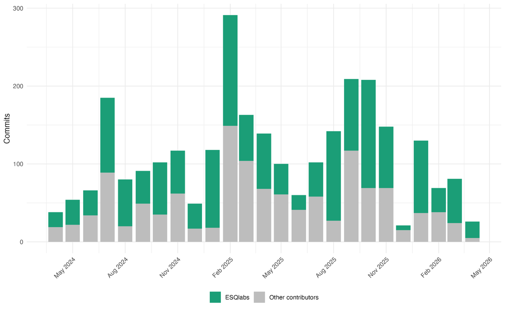
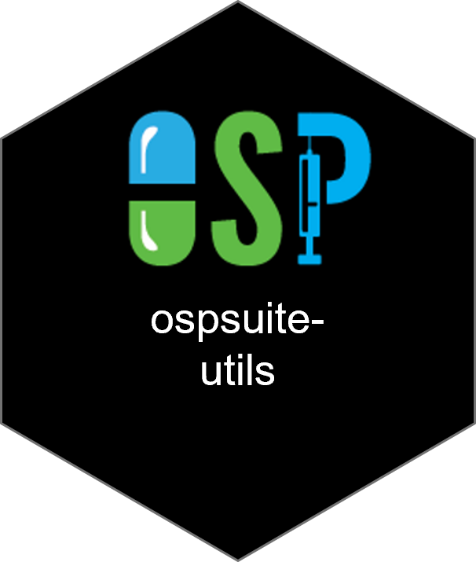
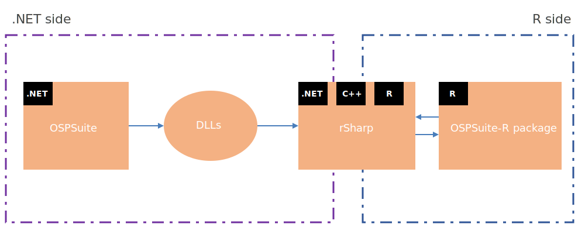
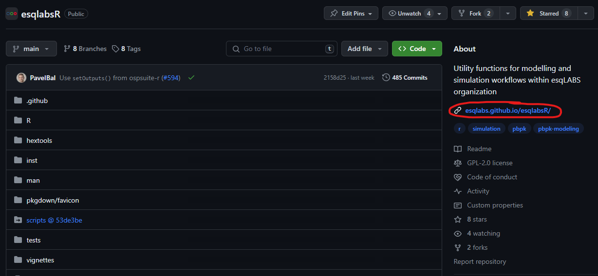
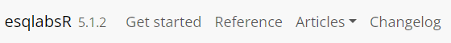

::: {.r-fit-text}
## **🎯 Goal: Familiarize with the packages of the OSP ecosystem and discern their respective functions and applications. **
:::


## Open System Pharmacology Suite


```{r, echo = FALSE}
# DO NOT DELETE THIS CODE CHUNK
#| include: false
showtext::showtext_auto()
```   

### Standalone softwares

::: {layout-ncol="2"}
{fig-align="center"}

{fig-align="center"}
:::

:::{.center-x}
A Modular software suite for efficient multi-scale modeling from whole-body to molecular levels.
:::

## {ospsuite} R packages

::: {.r-fit-text}
::: center-x
Bring the features of OSPSuite into R !\
`Code` instead of *clicks*
:::
:::

---

-   Growing collection of R packages
-   Free and Open Source
-   OSP Software R Developer Team members: 10+
-   Under (very) active development

{fig-align="center"}

---

{fig-align="center"}

# 👥 User Oriented Packages (Selection) {.center}

::: {layout-ncol="4"}


:::

---

::: columns
::: {.column width="40%"}
{fig-align="left"}
:::

::: {.column width="60%"}
**Main R interface with OSP Suite**

-   Load, Manipulate and Run Simulations
-   Shares the same simulation "Core" as PK-Sim and MoBi
-   Perform PK parameter calculations
-   Perform sensitivity analysis
-   Create standard plots
:::
:::

---

::: columns
::: {.column width="40%"}
{fig-align="left"}
:::

::: {.column width="60%"}
**Tailor Made Interface to OSPSuite R**

-   Excel-Driven Simulation Design - From scenario creation to automated reporting
-   Enforced Reproducibility - Simulation scenarios based workflow
-   Standardized Visualization
-   Advanced Sensitivity Analysis
-   Parameter Identification
-   GUI for interactive use
-   Agent-based modeling and simulation (in development)
:::
:::

---

::: columns
::: {.column width="40%"}
{fig-align="left"}
:::

::: {.column width="60%"}
**Estimate model parameters from observed data**

-  Parameter estimation using different optimization algorithms
-  Confidence intervals estimation
-  Custom cost functions
-  Standardized visualization of results

{fig-align="center"}
:::
:::

---

::: columns
::: {.column width="40%"}
{fig-align="left" width="337"}
:::

::: {.column width="60%"}
**Figures and tables generation**

- Generation of standard figures
- `{ggplot2}`-based plotting functions

{fig-align="center"}

:::
:::

# ⚙️ Development Oriented Packages {.center}

::: {layout-ncol="2"}
{width="337"}

{width="337"}
:::

---

::: columns
::: {.column width="40%"}
{fig-align="left" width="337"}
:::

::: {.column width="60%"}
**Interface with OSPSuite Core**

-   Allows the R packages to use PK-Sim and MoBi computational core

{fig-align="center"}
:::
:::

::: notes
OSPSuite-R package will use the same computational core as OSPSuite.
:::

---

::: columns
::: {.column width="40%"}
{fig-align="left" width="337"}
:::

::: {.column width="60%"}
**Utility functions used by all other packages from the OSPSuite R packages Universe**

-   Checks
-   Error messages
-   Predefined listing and objects
:::
:::

## Code Repositories

All packages are available open source on [GitHub.com](https://github.com)

{fig-align="center"}

## Documentation Websites

Each package has its own dedicated website containing:

  - Code Documentation
  - Get Started Tutorials
  - Vignettes
  - Changelog
  


## Documentation Websites (Selection)

- [esqlabs.github.io/esqlabsR/](https://esqlabs.github.io/esqlabsR/)
- [open-systems-pharmacology.org/OSPSuite-R](https://www.open-systems-pharmacology.org/OSPSuite-R/)
- [open-systems-pharmacology.org/OSPSuite.ParameterIdentification](https://open-systems-pharmacology.org/OSPSuite.ParameterIdentification/)
- [open-systems-pharmacology.org/OSPSuite.Plots](https://www.open-systems-pharmacology.org/OSPSuite.Plots/index.html)


