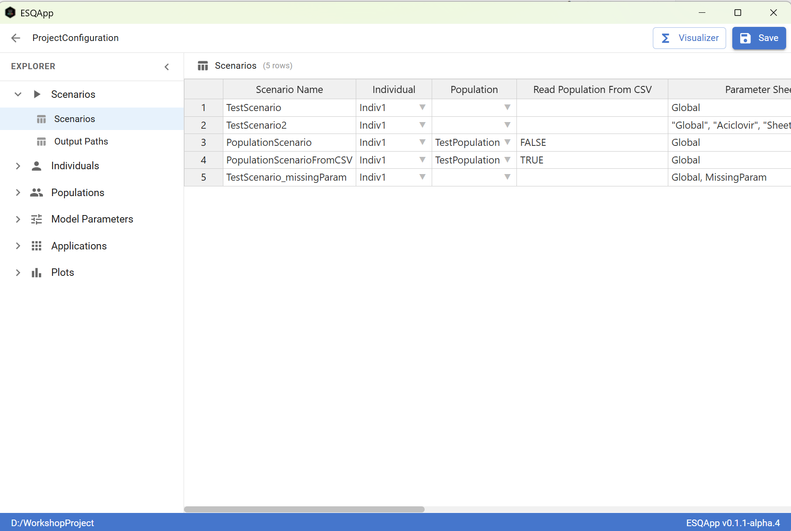
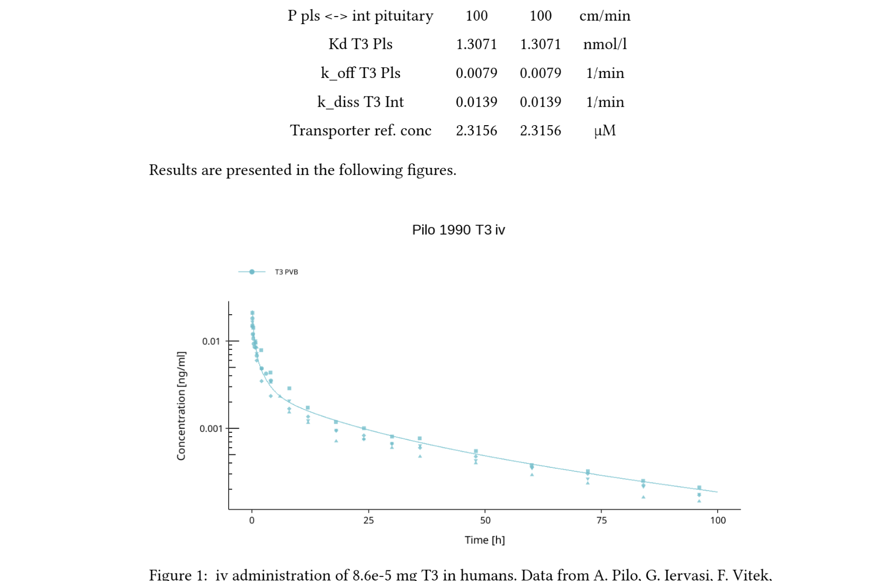

::: {.r-fit-text}
## 🎯 Goal: Understand {esqlabsR} structure and workflow
:::

# Introduction

## PKSim/MoBi vs `{ospsuite}`

:::: {.columns}

::: {.column width="50%"}

### PKSim/MoBi

::: {.incremental}
- Graphical Interface,
- No programming skills required,
- Cannot be 100% automated,
- No version control,
- Harder to reproduce.
:::

:::

::: {.column width="50%"}
### `{ospsuite}`

::: {.incremental}
- Can be 100% automated,
- Low-level access to the models,
- Easy to reproduce,
- Programming skills required.
:::
:::

::::

. . .

::: {.center-x}
**Need a bridge: keep the GUI ergonomics, gain reproducibility.**
:::

## `{esqlabsR}`

`{esqlabsR}` bridges the two approaches

- Scenario-centric workflow,
- From scenario definition to report generation,
- Graphical interface (Excel files, ESQapp, or agentic (in development)),
- Versionable,
- 100% reproducible.

## How does it work?

`{esqlabsR}` is based on:

- A 7 steps workflow supported by a set of easy-to-use functions,
- A collection of excel files that serve as input sources for the workflow.
- JSON representation of the project for programmatic processing.

## `{esqlabsR}`'s Workflow

:::: {.columns}

::: {.column width="50%"}
1. Project Initialization (once per project)
2. Scenario Design
3. Specify Figures
4. Specify Parameter Identification (optional)
:::

::: {.column width="50%"}
5. Perform Sensitivity Analysis (optional)
6. Execute tasks
7. Generate Markdown Report
:::

{fig-align="center"}

::::


## Excel Files

`{esqlabsR}`'s workflow relies on a collection of excel files with predefined structures.
These are the main interfaces for the user to define simulation scenarios.

```
 Project Folder
 ├── ...
 └── Configurations
     ├── PopulationsCSV
     │   └── TestPopulation.csv
     ├── Applications.xlsx
     ├── Individuals.xlsx
     ├── ModelParameters.xlsx
     ├── ParameterIdentification.xlsx
     ├── Plots.xlsx
     ├── Populations.xlsx
     └── Scenarios.xlsx
```

## Desktop Application

`{esqlabsR}` also provides a desktop application (ESQapp) to interact with the workflow in a more user-friendly way.

{fig-align="center"}

# Workflow Overview 

## Step 1: Project Initialization and structure

`{esqlabsR}` relies on a predefined project structure that keeps the project organized.

::: {.columns}

::: {.column width="40%"}
```
 Project Folder
 ├── Configurations
 ├── Data
 ├── Models
 │   └── Simulations
 ├── Results
 ├── ProjectConfiguration.json
 └── ProjectConfiguration.xlsx
```
:::

::: {.column width="60%"}
- 4 folders,
- 7 configuration files,
- `ProjectConfiguration.xlsx` + `ProjectConfiguration.json` to link them all.

:::

:::


::: {.center-x}
Standardized but can be customized. 
:::

## Step 2: Scenario Design

A scenario is defined by:

::: {.incremental}
- The simulation file containing the model structure, 
- Parameterization of the model, 
- Application protocol, 
- Physiology of the simulated individual or population.
:::

. . . 

All these elements are defined in the Excel files.

## Step 2: Scenario Structure

```{mermaid}
%%| fig-align: center
flowchart LR
  S(["Scenario"])
  S --> NAME["scenarioName"]
  S --> MODEL["modelFile<br/>(.pkml)"]
  S --> APP["applicationProtocol<br/><i>Applications.xlsx</i>"]
  S --> PHYS["Physiology"]
  PHYS --> IND["individualId<br/><i>Individuals.xlsx</i>"]
  PHYS --> POP["populationId<br/><i>Populations.xlsx</i>"]
  S --> PARAM["paramSheets<br/><i>ModelParameters.xlsx</i>"]
  S --> OUT["outputPaths"]
  S --> TIME["Simulation time<br/>(start, end, resolution)"]
  S --> SS["Steady-state<br/>(optional)"]
```

::: {.center-x}
Each property maps to a row or sheet in the configuration Excel files.
:::

## Step 3: Specify Figures

Figures are defined in `Plots.xlsx` and generated automatically when scenarios run.

```{mermaid}
%%| fig-align: center
flowchart LR
  P(["Plots.xlsx"])
  P --> DC["DataCombined"]
  DC --> DCN["DataCombinedName"]
  DC --> DT["dataType"]
  P --> PC["plotConfiguration"]
  PC --> PID["plotID"]
  PC --> PT["plotType<br/>(individual / population /<br/>observedVsSimulated /<br/>residualsVsSimulated /<br/>residualsVsTime)"]
  PC --> AX["axes / scales / limits<br/>(optional)"]
  P --> PG["plotGrids"]
  PG --> GN["name"]
  PG --> GP["plotIDs"]
  PG --> GT["title"]
```

## Step 4: Specify Parameter Identification (optional)

Three-step PI workflow:

1. PI tasks are built on configured scenarios.
2. Specify scenarios, parameters to estimate, and observed data in `ParameterIdentification.xlsx`.

## PI Excel Configuration

```{mermaid}
%%| fig-align: center
flowchart LR
  PI(["ParameterIdentification.xlsx"])
  PI --> PP["<b>PIParameters</b><br/><i>required</i><br/>parameters, bounds,<br/>start values, group"]
  PI --> POM["<b>PIOutputMappings</b><br/><i>required</i><br/>map sim outputs to<br/>observed data,<br/>scaling, weights"]
  PI --> PC["<b>PIConfiguration</b><br/><i>optional</i><br/>algorithm, CI method,<br/>error model"]
  PI --> AO["<b>AlgorithmOptions</b><br/><i>optional</i><br/>optimizer fine-tuning"]
  PI --> CIO["<b>CIOptions</b><br/><i>optional</i><br/>CI options"]
```

::: {.center-x}
Same `Group` value in `PIParameters` shares one parameter estimate across scenarios.
:::

## Step 5: Perform Sensitivity Analysis (optional)

:::: {.columns}

::: {.column width="50%"}
Automated re-runs with scaled parameters (default 0.1×–10×). Ranks parameters by influence on PK metrics (`C_max`, `t_max`, `AUC_inf`, ...).

R function: `sensitivityCalculation()`.

Output: spider, time-profile, and tornado plots.
:::

::: {.column width="50%"}


*Spider plot: PK parameter response across scaled inputs (esqlabsR vignette).*
:::

::::

[Sensitivity Analysis vignette](https://esqlabs.github.io/esqlabsR/dev/articles/sensitivity.html)

## Step 6: Execute

Scenarios are simulated, PI tasks run, SA performed, and figures generated based on the configurations defined in the Excel files.

- Subsets can be selected (only some scenarios / PI tasks / plots).
- Results can be saved and loaded later.

## Step 7: Generate Markdown Report

Quarto templates using the project configuration.

Pick scenarios, plot grids, and data sheets — `createResults()` runs the simulations and builds the figures:

```r
projectConfiguration <- createProjectConfiguration(
  here::here("ProjectConfiguration.xlsx")
)

reportResults <- createResults(
  projectConfiguration = projectConfiguration,
  scenarioNames        = c("Scenario_A", "Scenario_B"),
  dataSheets           = c("ObservedData"),
  plotGridNames        = c("PK_overview")
)
```

. . .

Embed a generated figure by referring to its `plotID`:

```r
#| label: fig-pk-overview
#| fig-cap: "PK overview for Scenario A & B."
reportResults$plots$PK_overview
```


## Rendered Report

{fig-align="center"}

## Resources

-   [`{esqlabsR}` documentation website](https://esqlabs.github.io/esqlabsR/)
-   [`{esqlabsR}` code repository](https://github.com/esqLABS/esqlabsR/)

