::: {.r-fit-text}
## 🎯 Goal: Create custom simulation scenarios
:::

```{r setup, include = FALSE}
library(esqlabsR)
library(here)
```

# Introduction

## Scenarios

In the `{esqlabsR}` framework, simulations are run by defining and executing **Scenarios**.

. . .

A **Scenario** takes the following inputs:

- Simulation file (model structure),
- Model parameters,
- Application protocol,
- Individual and/or population physiology.

## Step-wise Workflow

The `{esqlabsR}` framework follows a step-wise approach.

{fig-align="center"}

# `{esqlabsR}` Walkthrough

## Step 1: Modeling

1. Model development in PK-Sim/MoBi.
2. Store the `.pkml` file in the dedicated project folder (`Models/Simulations/` by default).

```{.bash code-line-numbers="3"}
myProject/Models/
└── Simulations/
    └── Aciclovir.pkml
```

## Step 2: Scenario Initialization

A new simulation scenario is created in `Scenarios.xlsx` (in `Configurations/` by default).

```{.bash code-line-numbers="9"}
myProject/Configurations/
├── Applications.xlsx
├── Individuals.xlsx
├── ModelParameters.xlsx
├── ParameterIdentification.xlsx
├── Plots.xlsx
├── Populations.xlsx
├── PopulationsCSV/
│   └── TestPopulation.csv
└── Scenarios.xlsx
```

::: {.callout-tip}
Run `validateAllConfigurations(projectConfiguration)` to sanity-check the Excel files (see B2).
:::

## Scenario Name

The `Scenario_name` column must hold a new **unique** name.

{fig-align="center"}

## Step 3: Link the Model File

Select the model `.pkml` file that will be used for the scenario. The file must be located in the folder defined in the `ProjectConfiguration` (`Models/Simulations/` by default).

{fig-align="center"}

::: {.callout-important}
File name only — not the full path.
:::

::: notes
At this point, the user can already run the simulation with the default "scenario" defined in the pkml file.
:::

## Step 4: Model Parameters

Model parameter sets are defined in `Model Parameters` view. Each sheet is one parameter set to apply.

Multiple sheets can be selected. In this case, the parameters from all sheets will be applied, with later sheets taking precedence in case of conflicts.

::: {layout-ncol=2 layout-valign="bottom"}

{fig-align="center"}

{fig-align="center"}

:::

## Step 5: Individuals

Individual biometrics are defined in the `Individual Biometrics` tab.

Additional parameters can be set in an individual-specific parameter set whose name matches the individual name.

::: {layout-ncol=2 layout-valign="bottom"}

{fig-align="center"}

{fig-align="center"}

:::

## Protein Ontogeny

Protein ontogenies adjust protein expression with age.

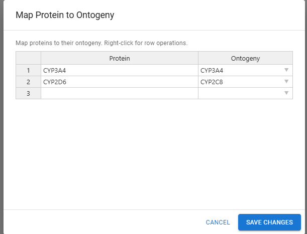{fig-align="center"}

## Step 6: Population

Populations are defined in the `Populations` tab:

- `Demographics` — population characteristics.
- `UserDefinedVariability` — custom distribution parameters.

::: {layout-ncol=2 layout-valign="bottom"}

{fig-align="center"}

{fig-align="center"}

:::

## Population from CSV

Populations can also come as `.csv` files (exported from PK-Sim or `{ospsuite}`).

Place such files in the `PopulationsCSV/` folder. Then:

- Set `PopulationId` to the `.csv` file name (without extension).
- Set `ReadPopulationFromCSV` to `TRUE`.

{fig-align="center"}

## Step 7: Time

{fig-align="center"}

## Step 8: Output Paths

`Output Paths` define the paths to molecules or parameters whose outputs will be stored for post-processing.

Define them once in the dedicated `Output Paths` tab — each row gets a unique `OutputPathId` plus its full `OutputPath`. Scenarios and other configuration sections then reference the `OutputPathId`, so the same path can be reused across multiple scenarios without retyping.

## Output Paths

Several IDs can be combined per scenario, comma-separated.

::: {layout="[70,30]" layout-valign="bottom"}

{fig-align="center"}

{fig-align="center"}

:::

## Step 9: Administration Protocol

- Different study designs are simulated by parameterizing application protocols.
- R does not yet support creating new administration protocols.
- Must rely on the pre-defined structure in the simulation `.pkml`.
- Switch protocols by setting application parameters: dose, administration time, infusion duration, etc.

## Select & Parameterize a Protocol

::: {layout-ncol=2 layout-valign="bottom"}

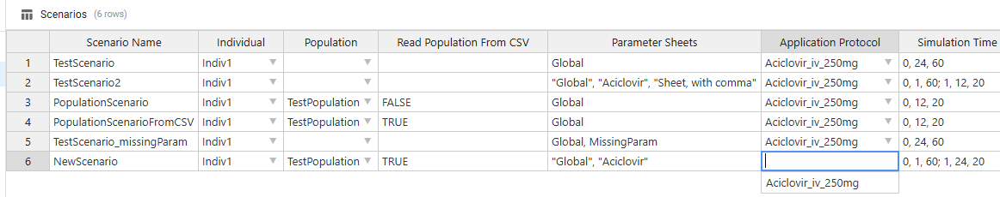{fig-align="center"}

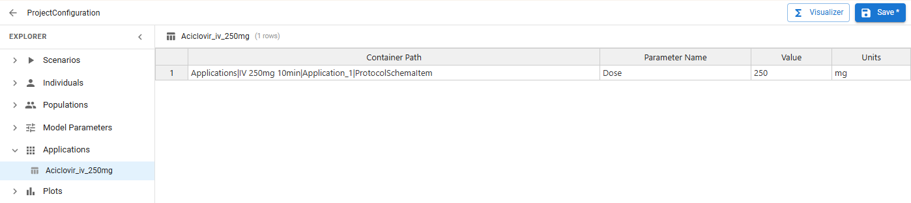{fig-align="center"}

:::

## Parametrization Hierarchy

Parameters are applied top-to-bottom — later layers override earlier ones for the same path.

```{mermaid}
%%| fig-align: center
flowchart TB
  P1["<div style='text-align:center'><b>1. .pkml defaults</b><br/><i>simulation file</i></div>"]
  P2["<div style='text-align:center'><b>2. Individual</b><br/><i>Individuals.xlsx</i></div>"]
  P2a["<div style='text-align:center'><b>2.1 Physiology</b><br/><i>IndividualBiometrics sheet</i></div>"]
  P2b["<div style='text-align:center'><b>2.2 Parameters</b><br/><i>individual-specific sheet</i></div>"]
  P3["<div style='text-align:center'><b>3. Population</b><br/><i>Populations.xlsx / .csv</i></div>"]
  P4["<div style='text-align:center'><b>4. Model parameter sheets</b><br/><i>ModelParameters.xlsx</i><br/>all selected sheets merged;<br/>later sheets overwrite earlier ones</div>"]
  P5["<div style='text-align:center'><b>5. Application protocol</b><br/><i>Applications.xlsx</i></div>"]
  P6["<div style='text-align:center'><b>6. Custom parameters</b><br/><i>customParams</i> arg of <code>createScenarios()</code></div>"]
  P1 --> P2
  P2 --> P2a
  P2 --> P2b
  P2a --> P3
  P2b --> P3
  P3 --> P4 --> P5 --> P6
  classDef base fill:#eef,stroke:#557,text-align:center;
  classDef top  fill:#fde,stroke:#955,text-align:center;
  class P1 base
  class P6 top
```

::: {.callout-tip}
The final set of parameters applied to the `.pkml` is available on each scenario via `scenarios$<scenarioName>$finalCustomParams`.
:::

# Running scenarios

## Summary {.smaller}

| Step | Function | What it does |
|---|---|---|
| 1 | `readScenarioConfigurationFromExcel()` | Parse Excel into `ScenarioConfiguration` — settings only, no model loaded. |
| 2 | `createScenarios()` | Build `Scenario` — loads `.pkml`, applies parameters/individual/population/time/outputs. |
| 3 | `runScenarios()` | Execute simulations, return results by scenario name. |

**Configuration vs Scenario** — `ScenarioConfiguration` = declaration. `Scenario` = realized simulation object with model loaded.

## Excel ↔ JSON Recap

- The R workflow (`readScenarioConfigurationFromExcel()` and friends) reads from the **Excel** files in `Configurations/`.
- The ESQapp, however, writes directly into the **JSON** snapshot (`ProjectConfiguration.json`).
- After editing the project in the ESQapp, the Excel files are out of sync. Restore them before running the R workflow:

```r
restoreProjectConfiguration("ProjectConfiguration.json")
```

::: {.callout-tip}
Use `projectConfigurationStatus()` to check whether the Excel files and the JSON snapshot are in sync (covered in B2).
:::

## Create a `ScenarioConfiguration`

Create a `ScenarioConfiguration` containing all the settings defined in the configuration files.

```{r}
projectConfiguration <- createProjectConfiguration(
  exampleProjectConfigurationPath(),
  ignoreVersionCheck = TRUE
)

# projectConfiguration tells `{esqlabsR}` where to find the configuration files
scenarioConfigurations <- readScenarioConfigurationFromExcel(
  scenarioNames = "TestScenario",
  projectConfiguration = projectConfiguration
)
```
::: {.callout-tip}
`ignoreVersionCheck = TRUE` is used here because the example project bundled with the package may have been created with a different version of `{esqlabsR}`. You will not need this in your own projects.
:::
## Inspect Configuration

```{r}
print(scenarioConfigurations, projectConfiguration = FALSE)
```

## Create `Scenarios`

`createScenarios()` loads the simulation file and applies all parameters from the `ScenarioConfiguration`.

```{r}
scenarios <- createScenarios(scenarioConfigurations)

scenarios$TestScenario$finalCustomParams
```

## Run Scenarios

```{r}
scenarioResults <- runScenarios(scenarios = scenarios)
```

Each result is accessible by scenario name:

```{r}
names(scenarioResults)
```

. . .

```{r}
scenarioResults$TestScenario$outputValues$data
```

# Exercises

## Exercise Overview

Practice with the **ESQapp** instead of editing Excel directly.

Compare two doses (250 mg base + 100 mg) of Aciclovir, with custom observation points for the 100 mg dose.

::: {.callout-important}
The ESQapp writes directly into `ProjectConfiguration.json`. After saving in the app, run `restoreProjectConfiguration("ProjectConfiguration.json")` in R so the Excel files (which the workflow reads from) get regenerated from the snapshot.
:::

## Open the Project

Launch ESQapp and open the training project.

::: {.callout-tip collapse="true"}
## Solution

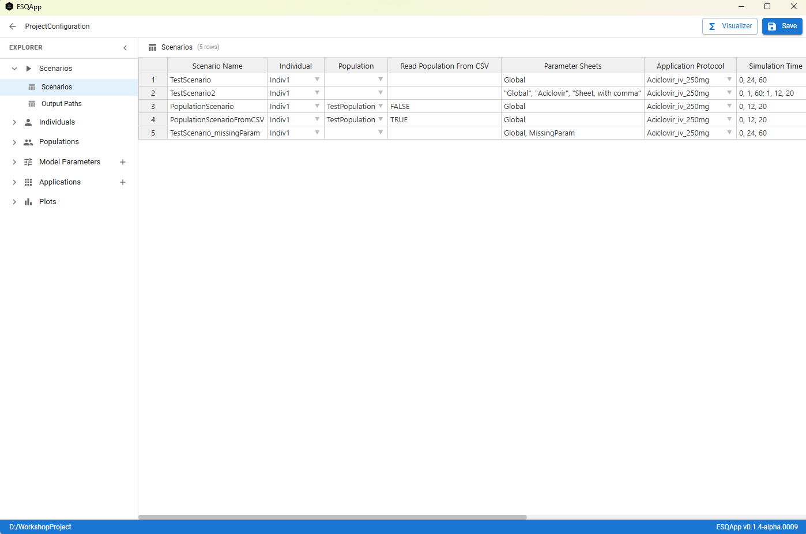{fig-align="center"}
:::

## Create a New Scenario

In the **Scenarios** view:

1. Remove the existing scenario.
2. Create scenario `scenarioExercise` — no changes from the simulation.
3. Create scenario `scenarioDose100` — different application protocol (configured in next step).

::: {.callout-tip collapse="true"}
## Solution

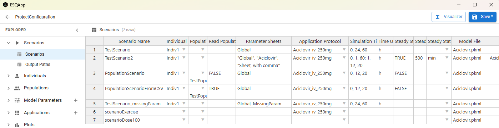{fig-align="center"}

`scenarioExercise` keeps the default `Aciclovir_iv_250mg` protocol; leaving the protocol field empty falls back to the dose in the original `.pkml`.
:::

## Change Application Protocol

In the **Applications** view, duplicate the existing `Aciclovir_iv_250mg` protocol and set the dose to 100 mg. Name the new protocol `Aciclovir_iv_100mg` and assign it to `scenarioDose100`.

::: {.callout-tip collapse="true"}
## Hint

Use the existing `Aciclovir_iv_250mg` entry as a template — only the `Dose` parameter changes.
:::

::: {.callout-tip collapse="true"}
## Solution — application parameters

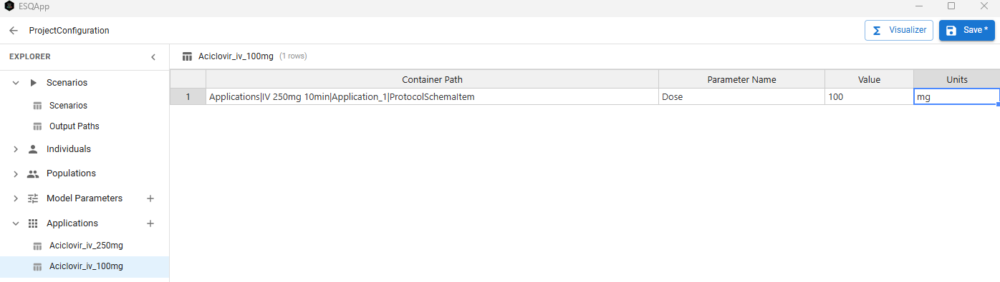{fig-align="center"}
:::

::: {.callout-tip collapse="true"}
## Solution — protocol attached to scenario

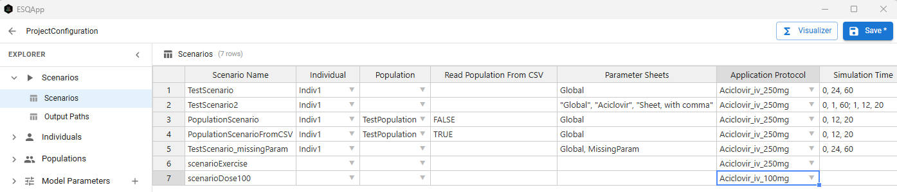{fig-align="center"}
:::

## Change Infusion Time

Duplicate the protocol again as `Aciclovir_iv_30min`, keep the original dose (250mg) but change the **infusion time** to 30 minutes.

::: {.callout-tip collapse="true"}
## Hint — parameter path

`Applications|IV 250mg 10min|Application_1|ProtocolSchemaItem|Infusion time`
:::

::: {.callout-tip collapse="true"}
## Solution

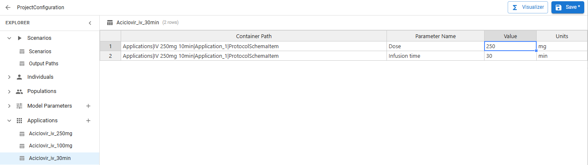{fig-align="center"}
:::

## Add More Observation Points

In the **Scenarios** view, edit the `SimulationTime` column:

- `scenarioDose100`: 2 points per minute until 30 minutes, then 1 point per minute until 24 h.
- `scenarioExercise`: 1 point per minute until 24 h.

::: {.callout-tip collapse="true"}
## Solution — simulation time

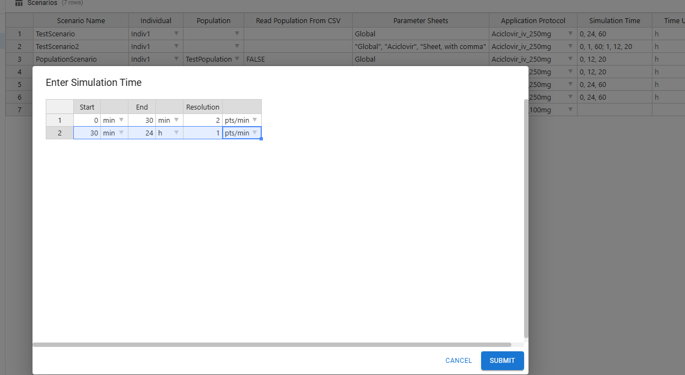{fig-align="center"}
:::

## Sync & Load Project

Save the project in the ESQapp (writes to `ProjectConfiguration.json`), then in R restore the Excel files and load the configuration:

```{r, echo = TRUE, eval = FALSE}
#| code-fold: true
#| code-summary: "Solution"
projectConfigurationPath <- here::here(
  "workshops/resources/B3/esqLabsR_training/ProjectConfiguration.xlsx"
)

# Bring the Excel files back in sync with the JSON snapshot
restoreProjectConfiguration(
  here::here(
    "workshops/resources/B3/esqLabsR_training/ProjectConfiguration.json"
  )
)

myProjectConfiguration <- createProjectConfiguration(
  path = projectConfigurationPath
)
```

## Run the Scenarios

```{r, echo = TRUE, eval = FALSE}
#| code-fold: true
#| code-summary: "Solution"
scenarioConfigurations <- readScenarioConfigurationFromExcel(
  projectConfiguration = myProjectConfiguration
)
scenarios <- createScenarios(scenarioConfigurations)
scenarioResults <- runScenarios(scenarios = scenarios)
# scenarioResults$scenarioExercise$outputValues$data -> outputs
```

## Add Model Parameters

In the **Model Parameters** view, create a new sheet (e.g. `NoRenalClearance`) that sets

`Neighborhoods|Kidney_pls_Kidney_ur|Aciclovir|Renal Clearances-TS|Tubular secretion`

to `0 l/min` (disables renal clearance).

Add a new scenario `scenarioNoRenalCl` (mirror `scenarioExercise`) and reference the new sheet in its `ModelParameterSheets` field.

::: {.callout-tip collapse="true"}
## Hint

Use `ospsuite::getAllParameterPathsIn(sim)` to find the Container Path if unsure.
:::

::: {.callout-tip collapse="true"}
## Solution — Model Parameters

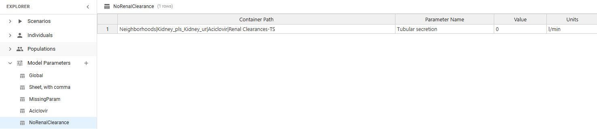{fig-align="center"}
:::

::: {.callout-tip collapse="true"}
## Solution — scenario reference

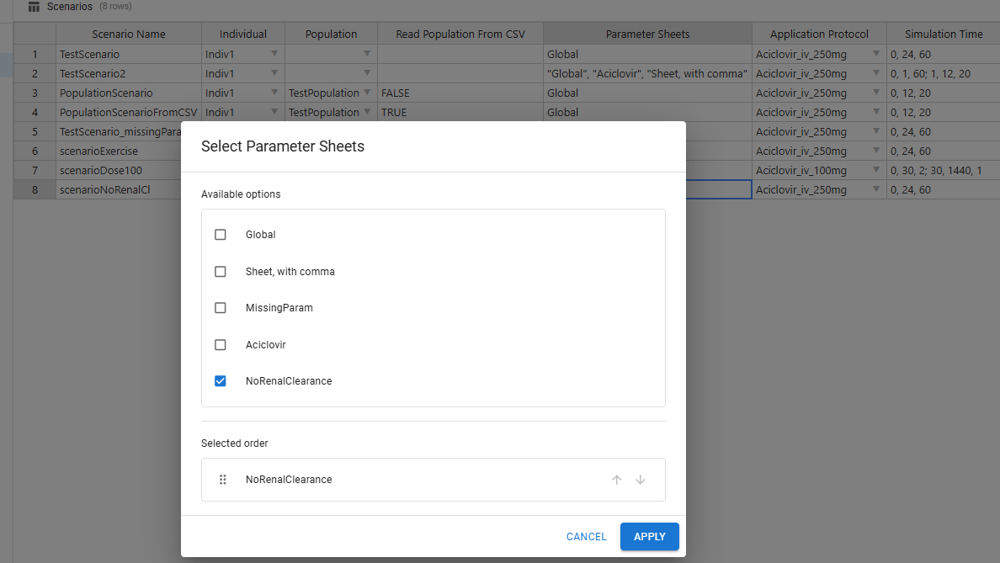{fig-align="center"}
:::

## Add a New Individual

In the **Individuals → Individual Biometrics** view, create an individual: Female, 60 years old, European, height 1.70 m, weight 60 kg.

Add scenario `Aciclovir_Female` mirroring `Aciclovir_iv_250mg` but referencing the new individual.

::: {.callout-tip collapse="true"}
## Solution — Individuals

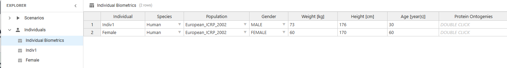{fig-align="center"}
:::

::: {.callout-tip collapse="true"}
## Solution — scenario

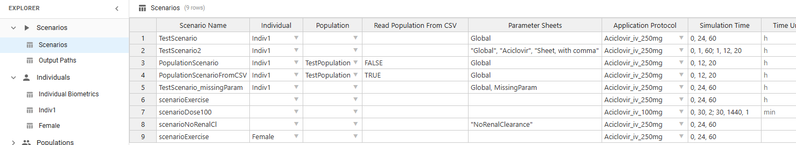{fig-align="center"}
:::

## Add a New Output

In the **Output Paths** view, add the whole-blood concentration of Aciclovir. Then attach it to `scenarioExercise` alongside the plasma concentration.

::: {.callout-tip collapse="true"}
## Hint — output path

`Organism|PeripheralVenousBlood|Aciclovir|Whole Blood (Peripheral Venous Blood)`
:::

::: {.callout-tip collapse="true"}
## Solution — Output Paths

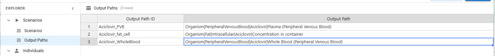{fig-align="center"}
:::

::: {.callout-tip collapse="true"}
## Solution — scenario outputs

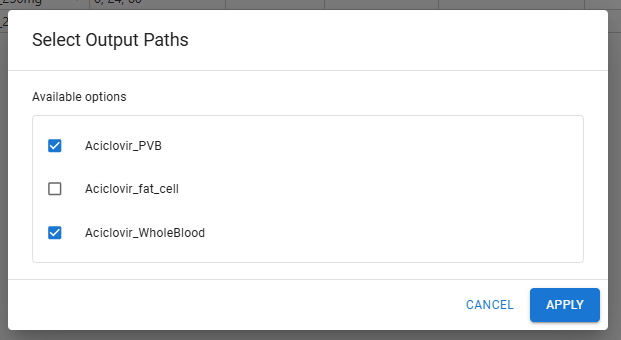{fig-align="center"}
:::

## Run All Scenarios

::: {.callout-important}
Save your configuration in the ESQapp before running — otherwise the JSON snapshot is stale and `restoreProjectConfiguration()` regenerates outdated Excel files.
:::

```{r, echo = TRUE, eval = FALSE}
#| code-fold: true
#| code-summary: "Solution"
restoreProjectConfiguration(
  here::here(
    "workshops/resources/B3/esqLabsR_training/ProjectConfiguration.json"
  )
)

myProjectConfiguration <- createProjectConfiguration(
  path = here::here(
    "workshops/resources/B3/esqLabsR_training/ProjectConfiguration.xlsx"
  )
)

scenarioConfigurations <- readScenarioConfigurationFromExcel(
  projectConfiguration = myProjectConfiguration
)

scenarios <- createScenarios(scenarioConfigurations)
scenarioResults <- runScenarios(scenarios = scenarios)
```

## Inspect the Results

```{r, echo = TRUE, eval = FALSE}
#| code-fold: true
#| code-summary: "Solution"
# All scenario names
names(scenarioResults)

# Output values for one scenario
scenarioResults$scenarioExercise$outputValues$data

# Final parameters applied to the .pkml
scenarios$scenarioExercise$finalCustomParams
```

::: {.callout-tip}
Creating figures from `scenarioResults` is covered in the next session.
:::

```{r, echo = FALSE}
trainingDir <- here::here("workshops/resources/B3/esqLabsR_training")
zipPath <- here::here("workshops/resources/B3/esqlabsR_training.zip")
if (dir.exists(trainingDir)) {
  zip::zip(
    files = list.files(trainingDir),
    zipfile = zipPath,
    root = trainingDir
  )
}
```

## Resources

- [`{esqlabsR}` documentation](https://esqlabs.github.io/esqlabsR/)
- [Scenario design article](https://esqlabs.github.io/esqlabsR/articles/design-scenarios.html)
- [`{esqlabsR}` code repository](https://github.com/esqLABS/esqlabsR/)
