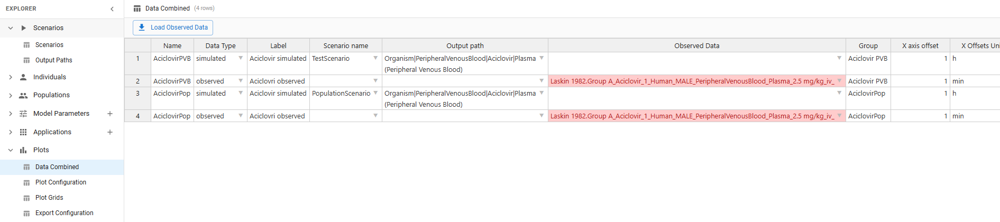
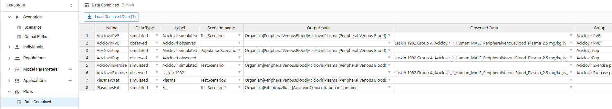
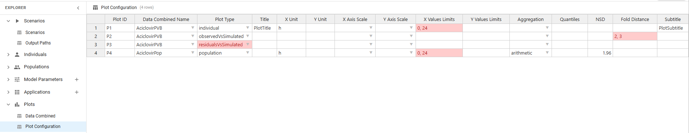
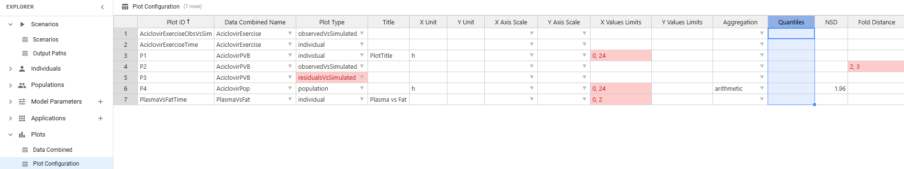
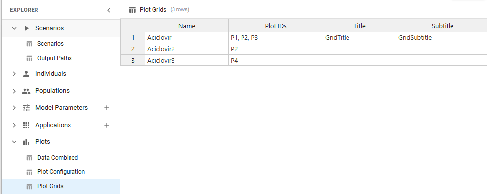
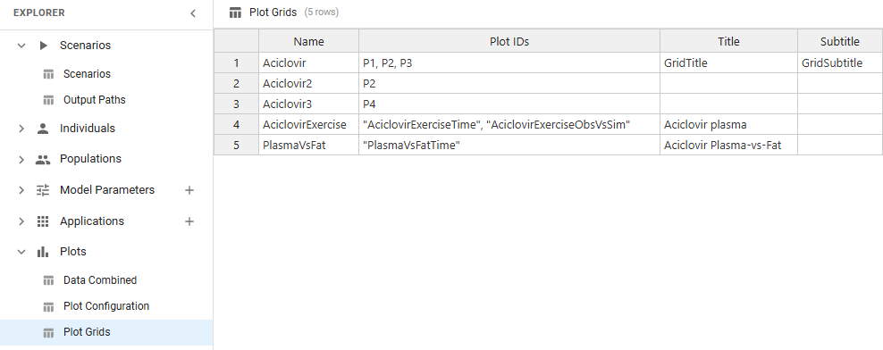
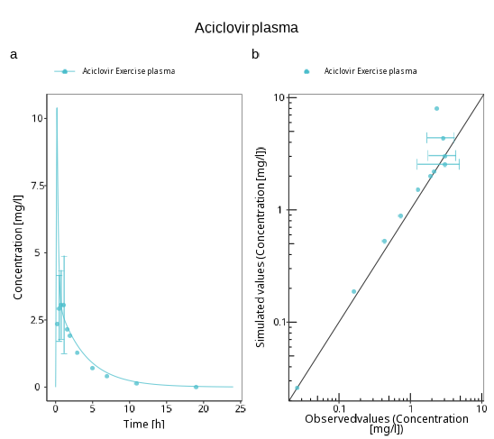
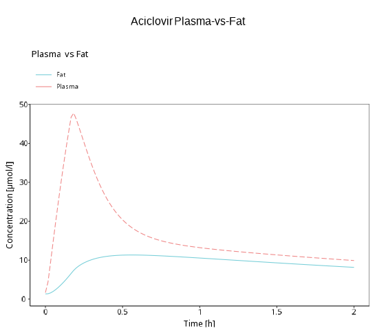

::: r-fit-text
## 🎯 Goal: Generate Plots using ESQlabsR {.center}
:::

```{r, include = FALSE}
knitr::opts_chunk$set(
  fig.showtext = TRUE,
  fig.align = "center",
  out.width = "61.8%"
)
library(esqlabsR)
```

## `Plots` view structure

All plots are defined in the `Plots` view of the **ESQapp**.

3 sub-sheets:

| Sub-sheet           | Purpose                                                                                       |
|---------------------|-----------------------------------------------------------------------------------------------|
| `DataCombined`      | Specify DataCombined objects (link simulation results with observed data, define group *etc*) |
| `plotConfiguration` | Define plot type, label texts, units, scales                                                  |
| `plotGrids`         | Combine plots into multi-panel figures                                                        |

## ESQapp ↔ JSON Recap

- The R workflow (`createPlotsFromExcel()` and friends) reads from the **Excel** files in `Configurations/`.
- The ESQapp writes directly into the **JSON** snapshot (`ProjectConfiguration.json`).
- After editing in the ESQapp, restore the Excel files before running the R workflow:

```r
restoreProjectConfiguration("ProjectConfiguration.json")
```

::: {.callout-tip}
Use `projectConfigurationStatus()` to check whether the Excel files and the JSON snapshot are in sync (covered in B2).
:::

## `{esqlabsR}` plot definition workflow

```{mermaid}
classDiagram
    direction LR
    class DataCombined {
        DataCombinedName
        dataType
        label
        scenario
        ...
    }
    class plotConfiguration {
        plotID
        DataCombinedName
        plotType
        title
        ...
    }
    class plotGrids {
        name
        plotID
        title
        ...
    }
    DataCombined --> plotConfiguration
    plotConfiguration --> plotGrids

    note for DataCombined "Simulation results and observed data"
    note for plotConfiguration "Data and type of each plot"
    note for plotGrids "Plots to combine on one panel"
```

# Setup

## Get the example project

`{esqlabsR}` ships with a ready-to-use TestProject. `exampleProjectConfigurationPath()` returns its `ProjectConfiguration.xlsx`.

The installed copy is read-only — copy it to a writable folder before editing in the ESQapp.

```{r, eval=FALSE}
#| code-fold: show
trainingDir <- file.path(tempdir(), "esqlabsR_training")
dir.create(trainingDir, showWarnings = FALSE, recursive = TRUE)
file.copy(
  list.files(dirname(exampleProjectConfigurationPath()), full.names = TRUE),
  to = trainingDir,
  recursive = TRUE,
  overwrite = TRUE
)
projectConfigurationPath <- file.path(trainingDir, "ProjectConfiguration.xlsx")
```

## Open in the ESQapp

Launch the ESQapp and open `trainingDir`. All exercises edit this copy.

::: {.callout-important}
Save in the ESQapp (Export) after every edit. Then in R run
`restoreProjectConfiguration(file.path(trainingDir, "ProjectConfiguration.json"))`
before reading the configuration with `{esqlabsR}`.
:::

# `DataCombined`

## How to fill the `DataCombined` view

:::{.callout-note title="Reminder"}
A `DataCombined` defines the data to be plotted. It can contain simulated results and/or observed data and links them together.
:::



## How to fill the `DataCombined` view — steps

1. Give a name in the `DataCombinedName` column.
2. Set the `label` (**mandatory**) — used as data set name in legends and downstream operations.
3. Add the simulation results:
   - set `dataType` to `simulated`
   - set `scenario` to the scenario name (as defined in the `Scenarios` view)
   - set the `path` to the simulation output path of interest
4. _Optional_ Add observed data:
   - set `dataType` to `observed`
   - set `dataSet` to the observed data set that will be imported.
5. Customise the `DataCombined` object:
   - set `group`, and more...

## Grouping data sets

All rows of one `DataCombined` are drawn on the same plot.

`group` controls **legend + visual styling**:

- Empty / unique `group` → each row gets distinct color, line/symbol style, separate legend entry (legend label = `label`).
- Shared `group` across rows → rows share one color and collapse to a single legend entry (legend label = `group`).
- Common pattern: pair a simulated row with its observed row under one `group` so they share color.

[Reference: OSPSuite-R DataCombined grouping](https://www.open-systems-pharmacology.org/OSPSuite-R/articles/data-combined.html#grouping).

::: {.callout-tip title="Inspect"}
After creating a `DataCombined` in R:

```r
myDataCombined$AciclovirExercise$groupMap
myDataCombined$AciclovirExercise$toDataFrame()
```
:::

## Exercise 1: Create a new `DataCombined`

The TestProject already contains scenarios `TestScenario` (plasma output) and `TestScenario2` (plasma + fat outputs).

1. In the ESQapp, open **Plots** > `DataCombined`.
2. Add 3 new rows: one named `AciclovirExercise`, two named `PlasmaVsFat`.

---

3. For `AciclovirExercise`, set `dataType` to `simulated`, `scenario` to `TestScenario`, `path` to `Aciclovir_PVB`, `label` to `Aciclovir simulated`, `group` to `Aciclovir Exercise plasma`.
4. For the two `PlasmaVsFat` rows, set `scenario` to `TestScenario2`. Plasma row: `path` `Aciclovir_PVB`, `label` to `Plasma`. Fat row: `path` `Aciclovir_fat_cell`, `label` to `Fat`.
5. Save the project (Export).

---

Now sync Excel and run the simulation.

```{r, eval=FALSE}
#| code-fold: true
#| code-summary: "Result"
#| output-location: default
library(esqlabsR)

restoreProjectConfiguration(
  file.path(trainingDir, "ProjectConfiguration.json")
)

myProjectConfiguration <- createProjectConfiguration(
  projectConfigurationPath,
  ignoreVersionCheck = TRUE
)

scenarios <- createScenarios(
  scenarioConfigurations = readScenarioConfigurationFromExcel(
    scenarioNames = c("TestScenario", "TestScenario2"),
    projectConfiguration = myProjectConfiguration
  )
)

results <- runScenarios(scenarios = scenarios)

names(results)
# TestScenario, TestScenario2, ...
```

## Load Observed Data

`{esqlabsR}` ships with:

- Predefined observed data template (`Data/*_TimeValuesData.xlsx`).
- The corresponding `ImporterConfiguration` (`Data/esqlabs_dataImporter_configuration.xml`).

Observed data is then loaded with `loadObservedData()`.


## Exercise 2: Add observed data

1. In the example project, open `Data/TestProject_TimeValuesData.xlsx` and identify the Aciclovir sheet.
2. Use `loadObservedData()` and assign the result to `observedData`.
3. Check the names of the `observedData` object.

```{r, eval=FALSE}
#| code-fold: true
#| code-summary: "Result"
#| output-location: default
# 1: sheet is "Laskin 1982.Group A"

# 2
observedData <- loadObservedData(
  projectConfiguration = myProjectConfiguration,
  sheets = c("Laskin 1982.Group A")
)

# 3
names(observedData)
```

---

4. Back in the ESQapp, **Plots** > `DataCombined`. Add a new row with `DataCombinedName` `AciclovirExercise`, `dataType` `observed`, `dataSet` `Laskin 1982.Group A`, `label` `Laskin 1982`.
5. Set `group` to `Aciclovir Exercise plasma` (matches sim row from Exercise 1) — pairs sim + observed under one color and one legend entry.
6. Save in the ESQapp, then re-run `restoreProjectConfiguration()` in R.

<details>
  <summary>Solution</summary>

Your `DataCombined` sub-sheet should look like:

{fig-align=center}

</details>

---

## Create `DataCombined` from configuration {.smaller}

Once a DataCombined is defined in the ESQapp, it can be created in R with `createDataCombinedFromExcel()`. Three main arguments:

- `projectConfiguration` the project configuration object (points at the Excel files).
- `dataCombinedNames` the names of the `DataCombined` to create. If `NULL` all are created.
- `simulatedScenarios` the simulated results to attach.

---

```{r, eval=FALSE}
#| output-location: default
createDataCombinedFromExcel(
  projectConfiguration = myProjectConfiguration,
  dataCombinedNames = "myDataCombined",
  simulatedScenarios = simulatedResults
)
```

## Exercise 3: Create DataCombined from configuration

Verify the `DataCombined` is correctly defined.

1. Create the DataCombined using `createDataCombinedFromExcel()`.
2. Check its names.


```{r, eval=FALSE}
#| code-fold: true
#| code-summary: "Result"
#| output-location: default
# 1
myDataCombined <- createDataCombinedFromExcel(
  projectConfiguration = myProjectConfiguration,
  dataCombinedNames = "AciclovirExercise",
  simulatedScenarios = results,
  observedData = observedData
)

# 2
names(myDataCombined)
```

## Residual diagnostics

Quantify fit numerically with `calculateResiduals()` — operates on a single `DataCombined` and returns observed − simulated.

```{r, eval=FALSE}
#| output-location: default
residuals <- calculateResiduals(
  dataCombined = myDataCombined$AciclovirExercise,
  scaling = "lin"
)

sum(residuals$residualValues)
```

- `scaling`: `"lin"` or `"log"` (matches the y-axis of the corresponding plot).
- Returns a `data.frame` with `residualValues`, `xValues`, and group info.

::: {.callout-tip}
Visualise residuals via `plotConfiguration` `plotType` `residualsVsTime` or `residualsVsSimulated`.
:::

# `plotConfiguration`

## How to fill the `plotConfiguration` view

1. Give an ID to the plot.
2. Reference the `DataCombined` object to use.
3. Select a `plotType` — one of `individual`, `observedVsSimulated`, `residualsVsTime`, `residualsVsSimulated`.
4. _Optional_ Set plot options in the corresponding columns.




:::{.callout-tip title="Tip"}
More options are available! Add a new column with the option name (use the "Add new column" action in the ESQapp).

Full list available in `ospsuite::DefaultPlotConfiguration$new()`.
:::

:::{.callout-tip title="Cell values"}
- Empty cell → default value.
- Multi-value field → comma-separated (e.g. `0, 2` for limits).
- Value containing a comma (e.g., title) → wrap in parentheses.
:::

## Exercise 4: Create new plots

1. In the ESQapp, open **Plots** > `plotConfiguration`.
2. Add 3 new rows. 2 referencing `AciclovirExercise`, 1 referencing `PlasmaVsFat`.
3. Set `plotType` to `individual` and `observedVsSimulated` for the `AciclovirExercise` rows. Set `individual` for `PlasmaVsFat`.
4. Customize: set a `title`. For `PlasmaVsFatTime`, set `xValuesLimits` to `0, 2` and `xUnit` to `h`.
5. Add supplementary settings (e.g. `caption`) of your choice.
6. Save in the ESQapp.

:::{.callout-tip title="Naming `plotID`"}
`plotID` must be unique across the sheet. Pick descriptive names — they appear in error messages and are referenced from `plotGrids`. Suggested pattern: `<DataCombined><PlotType>`, e.g.:

- `AciclovirExerciseTime` — `AciclovirExercise` + `individual`
- `AciclovirExerciseObsVsSim` — `AciclovirExercise` + `observedVsSimulated`
- `PlasmaVsFatTime` — `PlasmaVsFat` + `individual`

Avoid `P1`/`P2`/... — they collide with the seed plots already in the TestProject.
:::

<details>
  <summary>Solution</summary>

Your `plotConfiguration` sub-sheet should look like:

{fig-align=center}

</details>

# `plotGrids`

## How to fill the `plotGrids` view

`plotGrids` are the objects used to draw the plots.

It **must** be used to generate any plot defined in `plotConfiguration`.
It **can** combine several plots into a multi-panel figure.

---

1. Give a `name` to the plotGrid.
2. List the plots to include (separated by `,` for multi-panel).
3. _Optional_ Set plotGrid options.

{fig-align="center"}

. . .

:::{.callout-tip title="Tip"}
More options are available! Add a new column with the option name.

Full list available in `ospsuite::PlotGridConfiguration$new()`.
:::


## Exercise 5: Create new plotGrids

1. In the ESQapp, open **Plots** > `plotGrids`. Add 2 rows: `AciclovirExercise` and `PlasmaVsFat`.
2. In `AciclovirExercise`, include the two `AciclovirExercise` plot IDs. In `PlasmaVsFat`, include the `PlasmaVsFat` plot ID.
3. Add a `title`.
4. Save in the ESQapp.


<details>
  <summary>Solution</summary>

  Your `plotGrids` sub-sheet should look like:

  {fig-align=center}


</details>

# Generate Plots

Sync Excel and call `createPlotsFromExcel()`.

::: {.callout-important}
Save in the ESQapp before plotting — otherwise the JSON is stale.
:::

Four main arguments:

  - `plotGridNames` plotGrids to create. If `NULL` all are created.
  - `simulatedScenarios` simulated results referenced in the `DataCombined` — returned by `runScenarios()`.
  - `observedData` observed data referenced in the `DataCombined` — returned by `loadObservedData()`.
  - `projectConfiguration` the project configuration object — returned by `createProjectConfiguration()`.

. . .

```r
restoreProjectConfiguration(
  file.path(trainingDir, "ProjectConfiguration.json")
)

myProjectConfiguration <- createProjectConfiguration(projectConfigurationPath)

scenarios <- createScenarios(
  scenarioConfigurations = readScenarioConfigurationFromExcel(
    projectConfiguration = myProjectConfiguration
  )
)
simulatedScenarios <- runScenarios(scenarios = scenarios)

observedData <- loadObservedData(
  projectConfiguration = myProjectConfiguration,
  sheets = c("Laskin 1982.Group A")
)
```

## Exercise 6: Generate plots

1. Use `createPlotsFromExcel()` to generate `AciclovirExercise` and `PlasmaVsFat`.


```{r, eval=FALSE}
#| code-fold: true
#| code-summary: "Result"
#| output-location: default
restoreProjectConfiguration(
  file.path(trainingDir, "ProjectConfiguration.json")
)

myPlots <- createPlotsFromExcel(
  plotGridNames = c("AciclovirExercise", "PlasmaVsFat"),
  simulatedScenarios = results,
  observedData = observedData,
  projectConfiguration = myProjectConfiguration
)
```

---

```{r, eval=FALSE}
#| output-location: default
myPlots$AciclovirExercise
```

{fig-align="center"}

---

```{r, eval=FALSE}
#| output-location: default
myPlots$PlasmaVsFat
```
{fig-align="center"}

# Bonus: plot B3 scenarios

## Reuse the B3 project

Plot the scenarios built in **B3** — `scenarioExercise` (250 mg), `scenarioDose100` (100 mg), `scenarioNoRenalCl`, `Aciclovir_Female`, plus the whole-blood output added in B3.

::: {.callout-important}
Requires the project from B3. If skipped, re-run the B3 exercises first or open `workshops/resources/B3/esqLabsR_training/`.
:::

```{r, eval=FALSE}
#| code-fold: show
b3Dir <- here::here("workshops/resources/B3/esqLabsR_training")

restoreProjectConfiguration(file.path(b3Dir, "ProjectConfiguration.json"))

b3ProjectConfiguration <- createProjectConfiguration(
  file.path(b3Dir, "ProjectConfiguration.xlsx")
)

b3Scenarios <- createScenarios(
  readScenarioConfigurationFromExcel(projectConfiguration = b3ProjectConfiguration)
)
b3Results <- runScenarios(scenarios = b3Scenarios)
```

## Exercise 7: Dose comparison

Compare plasma profiles for 250 mg vs 100 mg.

1. ESQapp → open `b3Dir`. **Plots** > `DataCombined`.
2. Add 2 rows named `DoseCompare`.
3. Row 1 — `dataType` `simulated`, `scenario` `scenarioExercise`, `path` `Aciclovir_PVB`, `label` `250 mg`.
4. Row 2 — `dataType` `simulated`, `scenario` `scenarioDose100`, `path` `Aciclovir_PVB`, `label` `100 mg`.
5. Leave `group` empty → distinct colors per dose.
6. `plotConfiguration` → row `DoseCompareTime`, `DataCombinedName` `DoseCompare`, `plotType` `individual`, `title` `Aciclovir dose comparison`, `yAxisScale` `log`.
7. `plotGrids` → row `DoseCompare`, `plotID` `DoseCompareTime`.
8. Save (Export).

---

```{r, eval=FALSE}
#| code-fold: true
#| code-summary: "Result"
#| output-location: default
restoreProjectConfiguration(file.path(b3Dir, "ProjectConfiguration.json"))

b3Plots <- createPlotsFromExcel(
  plotGridNames = "DoseCompare",
  simulatedScenarios = b3Results,
  projectConfiguration = b3ProjectConfiguration
)

b3Plots$DoseCompare
```

## Exercise 8: Renal clearance impact

Show how disabling tubular secretion changes the plasma profile (`scenarioExercise` vs `scenarioNoRenalCl`).

1. ESQapp → `DataCombined`. Add 2 rows named `RenalImpact`.
2. Row 1 — `scenario` `scenarioExercise`, `path` `Aciclovir_PVB`, `label` `Default`.
3. Row 2 — `scenario` `scenarioNoRenalCl`, `path` `Aciclovir_PVB`, `label` `No renal clearance`.
4. `plotConfiguration` → `RenalImpactTime`, `plotType` `individual`, `title` `Renal clearance impact`, `yAxisScale` `log`.
5. `plotGrids` → `RenalImpact`, `plotID` `RenalImpactTime`.
6. Save.

```{r, eval=FALSE}
#| code-fold: true
#| code-summary: "Result"
#| output-location: default
b3Plots <- createPlotsFromExcel(
  plotGridNames = "RenalImpact",
  simulatedScenarios = b3Results,
  projectConfiguration = b3ProjectConfiguration
)

b3Plots$RenalImpact
```

## Exercise 9: Plasma vs whole blood

Use the whole-blood output added in B3 to compare compartments for `scenarioExercise`.

1. ESQapp → `DataCombined`. Add 2 rows named `CompartmentCompare`.
2. Row 1 — `scenario` `scenarioExercise`, `path` `Aciclovir_PVB`, `label` `Plasma`.
3. Row 2 — `scenario` `scenarioExercise`, `path` <your whole-blood OutputPathId from B3>, `label` `Whole blood`.
4. `plotConfiguration` → `CompartmentCompareTime`, `plotType` `individual`, `title` `Plasma vs whole blood`.
5. `plotGrids` → `CompartmentCompare`, `plotID` `CompartmentCompareTime`.
6. Save.

::: {.callout-note}
B3 did not pin a name for the whole-blood output. Use the `OutputPathId` you chose (e.g. `Aciclovir_WholeBlood`).
:::

## Exercise 10: Combined summary

Pack Exercises 7–9 into one multi-panel figure.

1. ESQapp → `plotGrids`. Add row `B3Summary`, `plotID` `DoseCompareTime, RenalImpactTime, CompartmentCompareTime`, `nrow` `1`, `title` `B3 scenario summary`.
2. Save.

```{r, eval=FALSE}
#| code-fold: true
#| code-summary: "Result"
#| output-location: default
b3Plots <- createPlotsFromExcel(
  plotGridNames = "B3Summary",
  simulatedScenarios = b3Results,
  projectConfiguration = b3ProjectConfiguration
)

b3Plots$B3Summary
```

## Resources

- [`{esqlabsR}` plotting article](https://esqlabs.github.io/esqlabsR/articles/plot-results.html)
- [`{ESQapp}` getting started](https://esqlabs.github.io/ESQapp/articles/getting-started.html)
