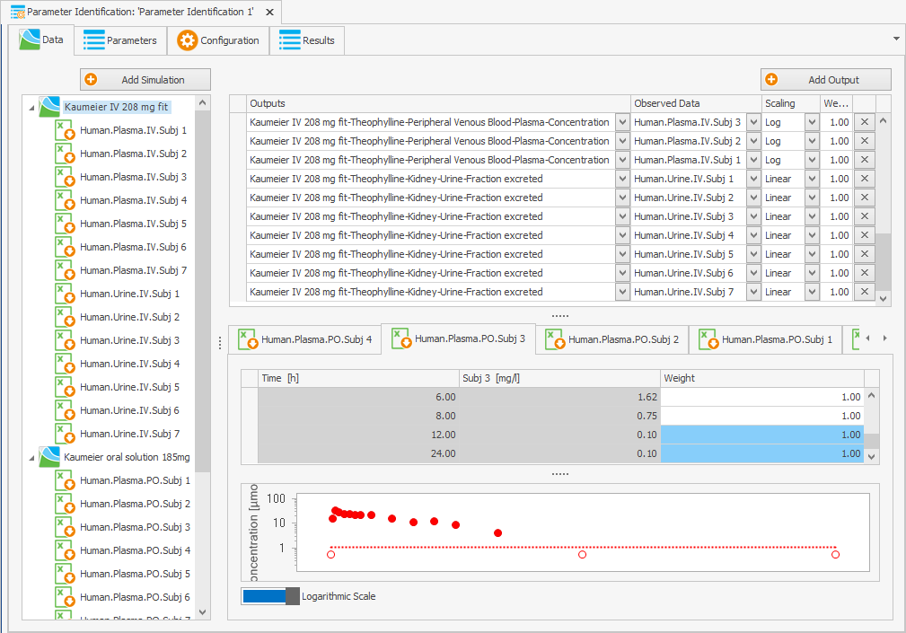

::: r-fit-text
## **🎯 Goal: Learn how to identify and optimize model parameters using observed data.**{.center}
:::

```{r setup, echo = FALSE}
knitr::opts_chunk$set(fig.showtext = TRUE, fig.align = "center")
```

## Parameter Identification in PK-Sim

{fig-align="center"}

::: center-x
Also available using `{ospsuite.parameteridentification}` !
:::

## Overview

1.  Building blocks of `ParameterIdentification`
2.  Parameter Identification setup
3.  Run parameter identification and explore results
4.  Advanced `PIConfiguration` settings
5.  Confidence interval estimation
6.  Identifiability diagnostics

# Building blocks of `ParameterIdentification`

---

Creating a `ParameterIdentification` instance requires:

-   defined simulations
-   identification parameters
-   mappings of observed and simulated data
-   configuration settings

Example with all potential input parameters:

```{r, eval = FALSE}
#| output-location: default
piTask <- ParameterIdentification$new(
  simulations = sims,
  parameters = params,
  outputMappings = mappings,
  configuration = piConfig
)
```

::: callout-important
## Don't run. 
Let's create the input parameters first!
:::

# Parameter Identification Setup


## Parameter Identification Setup:

-   Optimize lipophilicity and renal clearance parameters.
-   Use plasma concentration data from a 10-minute intravenous infusion of aciclovir at 250 mg and 500 mg doses.

---

## Steps:

1.  Load simulations
2.  Modify simulation doses
3.  Define parameters for identification
4.  Map simulation outputs to data
5.  Configure parameter identification
6.  Create `ParameterIdentification`
7.  Run parameter identification

---

### Load simulations

Load `{ospsuite.parameteridentification}`

```{r}
#| output-location: default
library(ospsuite.parameteridentification)
```

Load two instances of the Aciclovir PBPK model to optimize lipophilicity and renal clearance for 250 mg and 500 mg doses:

```{r}
#| output-location: default
sim_250mg <- loadSimulation(system.file(
  "extdata",
  "Aciclovir.pkml",
  package = "ospsuite"
))
sim_500mg <- loadSimulation(system.file(
  "extdata",
  "Aciclovir.pkml",
  package = "ospsuite"
))
```

::: callout-note
Utilize `Simulation` objects as described in `{ospsuite-r}` documentation on [how to load and adjust simulations](https://www.open-systems-pharmacology.org/OSPSuite-R/articles/load-get.html).
:::

---

### Modify simulation doses

Retrieve the path to the dose parameter from the first simulation:

```{r}
#| output-location: default
doseParameterPath <- "Events|IV 250mg 10min|Application_1|ProtocolSchemaItem|Dose"
```

Retrieve the objects of the application dose parameters:

#### 250 mg

```{r}
sim_250mg_doseParam <- getParameter(
  path = doseParameterPath,
  container = sim_250mg
)

print(sim_250mg_doseParam)
```

---

#### 500 mg - set the dose value to 500 mg

```{r}
sim_500mg_doseParam <- getParameter(
  path = doseParameterPath,
  container = sim_500mg
)
setParameterValues(parameters = sim_500mg_doseParam, values = 500, units = "mg")

print(sim_500mg_doseParam)
```

---

### Define parameters for identification

-   `PIParameters` objects define parameters for optimization, grouping single or multiple model parameters with uniform values during optimization.

-   `PIParameters` specify starting points and range (min/max values) for optimization.

-   Multiple model parameters within a `PIParameters` instance can span across different simulations, allowing for coordinated optimization of shared or individual parameters.

---

Define three PIParameters objects to optimize parameters across simulations.\

[Lipophilicity]{.underline} - Link the lipophilicity parameter between two simulations to optimize jointly:

```{r}
#| output-location: default
piParameterLipo <- PIParameters$new(
  parameters = list(
    getParameter(path = "Aciclovir|Lipophilicity", container = sim_250mg),
    getParameter(path = "Aciclovir|Lipophilicity", container = sim_500mg)
  )
)
```

[Renal Clearance]{.underline} - Create separate PIParameters renal clearance to be independently optimized in each simulation for 250mg and 500mg doses:

```{r}
#| output-location: default
piParameterCl_250mg <- PIParameters$new(
  parameters = getParameter(
    path = "Neighborhoods|Kidney_pls_Kidney_ur|Aciclovir|Renal Clearances-TS-Aciclovir|TSspec",
    container = sim_250mg
  )
)

piParameterCl_500mg <- PIParameters$new(
  parameters = getParameter(
    path = "Neighborhoods|Kidney_pls_Kidney_ur|Aciclovir|Renal Clearances-TS-Aciclovir|TSspec",
    container = sim_500mg
  )
)
```

---

`PIParameter` Properties:

```{r}
print(piParameterCl_250mg)
```

. . .


-   `$currValue`: Current parameter value, defaults to the first linked parameter.
-   `$startValue`, `$minValue`, `$maxValue`: Configurable start, minimum, and maximum values.
-   `$unit`: Value unit

---

Extend lipophilicity boundaries to \[-5, 5\] and renal clearance to \[0, 5\] 1/min:

```{r}
#| output-location: default
piParameterLipo$minValue <- -5

piParameterLipo$maxValue <- 5

piParameterCl_250mg$minValue <- 0

piParameterCl_250mg$maxValue <- 5

piParameterCl_250mg$unit <- ospUnits$`Inversed time`$`1/min`

piParameterCl_500mg$minValue <- 0

piParameterCl_500mg$maxValue <- 5

piParameterCl_500mg$unit <- ospUnits$`Inversed time`$`1/min`
```

::: callout-caution
Changing units doesn't auto-adjust values.
:::

## Map simulation outputs to data

-   Mapping between simulated outputs and observed data is achieved through `PIOutputMapping` objects.

-   Model error calculation requires linking simulation outputs to observed data, where one output can be mapped to multiple data sets, summing errors from each pair.

---

Load observed data sets for aciclovir concentration from the provided Excel file:

```{r}
filePath <- system.file(
  "extdata",
  "Aciclovir_Profiles.xlsx",
  package = "ospsuite.parameteridentification"
)

# Create importer configuration for the file

importConfig <- createImporterConfigurationForFile(filePath = filePath)

# Set naming pattern

importConfig$namingPattern <- "{Source}.{Sheet}.{Dose}"

# Import data sets

obsData <- loadDataSetsFromExcel(
  xlsFilePath = filePath,
  importerConfigurationOrPath = importConfig,
  sheets = NULL
)

print(names(obsData))
```

---

Define the simulation output path for aciclovir venous blood concentration:

```{r}
#| output-location: default
simOutputPath <- "Organism|PeripheralVenousBlood|Aciclovir|Plasma (Peripheral Venous Blood)"
```

Instantiate two `PIOutputMapping` objects for each dose group:

```{r}
#| output-location: default
outputMapping_250mg <- PIOutputMapping$new(
  quantity = getQuantity(path = simOutputPath, container = sim_250mg)
)

outputMapping_500mg <- PIOutputMapping$new(
  quantity = getQuantity(path = simOutputPath, container = sim_500mg)
)
```

Associate simulation results with their corresponding observed data:

```{r}
#| output-location: default
outputMapping_250mg$addObservedDataSets(
  obsData$`Aciclovir_Profiles.Vergin 1995.Iv.250 mg`
)
outputMapping_500mg$addObservedDataSets(
  obsData$`Aciclovir_Profiles.Vergin 1995.Iv.500 mg`
)
```

Adjust output mapping scaling to logarithmic for concentration data:

```{r}
outputMapping_250mg$scaling <- "log"
outputMapping_500mg$scaling <- "log"
print(outputMapping_250mg) # 500 mg mapping is analogous
```

::: {.callout-tip}
Per-dataset or per-point weights can be supplied via the `weights` argument of `$addObservedDataSets()`, or after construction with `$setDataWeights()`. Custom x/y offsets and scaling factors are available via `$setDataTransformations()`.
:::

## Configure parameter identification

Configure PI through a reusable `PIConfiguration` object:

```{r}
piConfiguration <- PIConfiguration$new()

print(piConfiguration)
```

You can enable printing current parameter values and error at every objective evaluation by setting `printEvaluationFeedback` property to `TRUE`. Useful for diagnosing slow runs; noisy in normal use.


. . .

::: callout-note
The above configuration employs default configuration settings.
:::

# Run parameter identification and explore results

---

Use defined simulations, parameters, data mappings, and configurations in a `ParameterIdentification` class instance.

```{r, echo=FALSE}
#| output-location: default
# Snapshot starting values so later comparison runs start from the same point
initialValues <- list(
  lipo = piParameterLipo$currValue,
  cl250 = piParameterCl_250mg$currValue,
  cl500 = piParameterCl_500mg$currValue
)
piParameterLipo$startValue <- initialValues$lipo
piParameterCl_250mg$startValue <- initialValues$cl250
piParameterCl_500mg$startValue <- initialValues$cl500
```

```{r}
#| output-location: default
piTask <- ParameterIdentification$new(
  simulations = list(sim_250mg, sim_500mg),
  parameters = list(piParameterLipo, piParameterCl_250mg, piParameterCl_500mg),
  outputMappings = list(outputMapping_250mg, outputMapping_500mg),
  configuration = piConfiguration
)
```

::: callout-important
`PIConfiguration` is an R6 reference object. The `ParameterIdentification` task holds a *reference* to it, not a copy — mutating fields like `piConfiguration$algorithm <- "DEoptim"` after `piTask` is built takes effect on the **next** `piTask$run()` call without rebuilding the task or reassigning the configuration. To compare configurations, clone before mutating: `piConfiguration$clone(deep = TRUE)`.
:::

---

Generate time profiles to compare current parameter values' simulation results with observed data, creating one for each `PIOutputMapping`.

```{r, eval=FALSE}
piTask$plotResults()
```

---

Run the PI task and print the results:

```{r}
piResults <- piTask$run()
print(piResults)
```

---

```{r, echo=FALSE, fig.width=15, fig.height=6, fig.cap="Optimized fit to observed data — 250 mg (left) and 500 mg (right)"}
library(patchwork)
piTask$plotResults()[[1]] + piTask$plotResults()[[2]]
```

::: {.callout-tip title="Goodness-of-fit criteria"}
- Time profiles close to observed data points.
- Residuals randomly distributed above and below zero.
- Systematic bias (all residuals same sign) → over- or underprediction; revisit starting values or parameter bounds.
:::

# Advanced PIConfiguration settings

```{r, echo=FALSE}
# Helper: reset parameter values so each variant starts from the same point
resetParams <- function() {
  piParameterLipo$setValue(initialValues$lipo)
  piParameterCl_250mg$setValue(initialValues$cl250)
  piParameterCl_500mg$setValue(initialValues$cl500)
}

# Helper: build a fresh task with a given configuration
makeTask <- function(config) {
  ParameterIdentification$new(
    simulations = list(sim_250mg, sim_500mg),
    parameters = list(
      piParameterLipo,
      piParameterCl_250mg,
      piParameterCl_500mg
    ),
    outputMappings = list(outputMapping_250mg, outputMapping_500mg),
    configuration = config
  )
}

# Helper: per-parameter estimates tagged with config label
estimatesDf <- function(piRes, label) {
  df <- piRes$toDataFrame()
  df$config <- label
  df[, c("config", "name", "estimate")]
}

# Helper: one-row runtime summary (eval count, elapsed, final cost)
runStats <- function(piRes, label) {
  res <- piRes$toList()
  data.frame(
    config = label,
    fnEvaluations = res$fnEvaluations %||% NA_integer_,
    elapsed_s = round(res$elapsed %||% NA_real_, 2),
    totalError = signif(res$objectiveValue %||% NA_real_, 4),
    stringsAsFactors = FALSE
  )
}

# Skip auto-CI on variants — keeps elapsed_s comparable to baseline optimization-only cost
# Each clone below sets piConfig_*$autoEstimateCI <- FALSE before $run()
```

---

## Residual weighting

`residualWeightingMethod` decides how each residual is scaled before entering the cost sum:

- `"none"` (default) — raw residuals; large-magnitude points dominate the fit.
- `"error"` — divide residuals by `yErrorValues` of the observed dataset; points with smaller measurement error pull harder. Requires `yErrorValues` on data.

Implication: with `"error"` the optimizer trusts low-error points more, which typically tightens the fit at high-concentration peaks where reported errors are smaller in absolute terms and loosens it on noisy tail points.

---

```{r, eval=FALSE}
piConfiguration$objectiveFunctionOptions$residualWeightingMethod <- "error"
```

Compare results with default weighting vs. error-based weighting:

```{r, echo=FALSE}
piConfig_w <- piConfiguration$clone(deep = TRUE)
piConfig_w$objectiveFunctionOptions$residualWeightingMethod <- "error"
piConfig_w$autoEstimateCI <- FALSE

resetParams()
piTask_w <- makeTask(piConfig_w)
piResults_weighted <- piTask_w$run()
```

```{r, echo=FALSE}
rbind(
  estimatesDf(piResults, "default (none)"),
  estimatesDf(piResults_weighted, "error")
)
```

```{r, echo=FALSE}
rbind(
  runStats(piResults, "default (none)"),
  runStats(piResults_weighted, "error")
)
```

---

```{r, echo=FALSE, fig.width=15, fig.height=6, fig.cap="Residual weighting = 'error' — fit on 250 mg (left) and 500 mg (right) doses"}
piTask_w$plotResults()[[1]] + piTask_w$plotResults()[[2]]
```

## Objective function type and robust estimation

`objectiveFunctionType` selects the cost form:

- `"lsq"` (default) — weighted least squares on uncensored points only.
- `"m3"` — Beal's M3: uncensored points use weighted SSR; censored (BLQ) points contribute their probability of being below LLOQ. Requires per-point `LLOQ` column on the dataset.

---

`robustMethod` downweights outlier residuals so they cannot dominate the fit:

- `"none"` (default) — every residual contributes fully.
- `"huber"` — quadratic for small residuals, linear for large ones; mild outlier resistance.
- `"bisquare"` — fully zeroes residuals beyond a threshold; aggressive, can hide poor fits.

---

```{r, eval=FALSE}
piConfiguration$objectiveFunctionOptions$robustMethod <- "huber"
```

```{r, echo=FALSE}
piConfig_h <- piConfiguration$clone(deep = TRUE)
piConfig_h$objectiveFunctionOptions$robustMethod <- "huber"
piConfig_h$autoEstimateCI <- FALSE

resetParams()
piTask_h <- makeTask(piConfig_h)
piResults_huber <- piTask_h$run()
```

Compare estimates:

```{r, echo=FALSE}
rbind(
  estimatesDf(piResults, "default (none)"),
  estimatesDf(piResults_huber, "huber")
)
```

Runtime and final cost:

```{r, echo=FALSE}
rbind(
  runStats(piResults, "default (none)"),
  runStats(piResults_huber, "huber")
)
```

---

```{r, echo=FALSE, fig.width=15, fig.height=6, fig.cap="Robust = 'huber' — fit on 250 mg (left) and 500 mg (right) doses"}
piTask_h$plotResults()[[1]] + piTask_h$plotResults()[[2]]
```

::: callout-note
See [`{ospsuite.parameteridentification}` error calculation vignette](https://www.open-systems-pharmacology.org/OSPSuite.ParameterIdentification/articles/error-calculation.html) for guidance on residual weighting and robust methods.
:::

## Algorithm options

`algorithm` selects the optimizer; the choice drives convergence behaviour:

- `"BOBYQA"` (default) — gradient-free local search; fast, but stuck at local optima if the start point is poor.
- `"HJKB"` — Hooke–Jeeves with bounds; local, derivative-free, robust to non-smooth objectives.
- `"DEoptim"` — differential evolution; global, parallel population search. Much slower, but escapes local minima.

--- 

`algorithmOptions` carries per-algorithm tuning (max iterations, tolerances, population size). Build it from the matching `AlgorithmOptions_<NAME>` constant; mismatched options are silently ignored.

::: callout-note
`AlgorithmOptions_<NAME>` constants are plain named lists, so `deOpts <- AlgorithmOptions_DEoptim` is a value copy — mutating `deOpts` does not affect the package-level template. Same applies to `AlgorithmOptions_BOBYQA` and `AlgorithmOptions_HJKB`.
:::

Implication: switching to `"DEoptim"` lets the search escape the BOBYQA basin and may land on a different (often globally better) optimum at the cost of orders-of-magnitude longer runtime.

---

Using a deliberately small `itermax`/`NP` for this example to keep the runtime short; increase for real use.

```{r}
piConfig_de <- PIConfiguration$new()
piConfig_de$algorithm <- "DEoptim"
piConfig_de$autoEstimateCI <- FALSE

deOpts <- AlgorithmOptions_DEoptim
deOpts$itermax <- 20 # default 200 — capped for fast demo
deOpts$NP <- 15 # default NA (10 * nparams)
deOpts$storepopfrom <- deOpts$itermax + 1 # disable population storage (must be > itermax)
piConfig_de$algorithmOptions <- deOpts
```

```{r, echo=FALSE}
resetParams()
piTask_de <- makeTask(piConfig_de)
piResults_deopt <- piTask_de$run()
```

---

Compare estimates:

```{r}
rbind(
  estimatesDf(piResults, "BOBYQA"),
  estimatesDf(piResults_deopt, "DEoptim")
)
```

Runtime and final cost:

```{r}
rbind(
  runStats(piResults, "BOBYQA"),
  runStats(piResults_deopt, "DEoptim")
)
```

---

```{r, echo=FALSE, fig.width=15, fig.height=6, fig.cap="Algorithm = 'DEoptim' — fit on 250 mg (left) and 500 mg (right) doses"}
piTask_de$plotResults()[[1]] + piTask_de$plotResults()[[2]]
```

::: callout-note
See [`{ospsuite.parameteridentification}` optimization algorithms vignette](https://www.open-systems-pharmacology.org/OSPSuite.ParameterIdentification/articles/optimization-algorithms.html) for full option reference.
:::


# Confidence interval estimation

## What is a confidence interval?

A point estimate (`estimate` column of `piResults$toDataFrame()`) is the single parameter value that minimizes the cost on this dataset. It says nothing about how *certain* that value is. A 95% confidence interval (CI) is a range that, under repeated sampling of new data from the same underlying process, would contain the true parameter value 95% of the time.

Equivalent intuition: the CI is the set of parameter values that are *not statistically distinguishable* from the optimum given the observed data and the assumed noise model. Outside the interval, the cost rises enough that the data favours the optimum over the trial value.

## Why estimate CIs?

::: r-fit-text
- **Identifiability check** — a CI that spans a large fraction of the prior range (or hits the bounds) means the data does not constrain that parameter; the point estimate is essentially arbitrary. Refit with more data, fix the parameter, or remove it from the optimization.
- **Decision-relevant uncertainty** — downstream predictions (Cmax, AUC, dose recommendations) inherit the parameter uncertainty. Propagating CIs (or sampling from the covariance matrix) gives a credible range on the prediction, not a false-precision single number.
- **Model comparison** — overlapping CIs between dose groups or studies suggest the parameter can be shared; non-overlapping CIs argue against pooling.
- **Reporting requirement** — regulatory submissions and population-PK analyses expect parameter precision metrics (`sd`, `cv`, `lowerCI`, `upperCI`).
:::

## Choosing `ciMethod`

`ciMethod` selects how CIs around the fitted parameters are computed:

- **`"hessian"`** (default) — invert the numerical Hessian at the optimum; cheap, assumes locally quadratic cost surface, can be unreliable near bounds or for non-identifiable parameters.
- **`"PL"` (profile likelihood)** — for each parameter, refit the others while sweeping its value to find the cost-rise threshold. More robust to non-linearity, but each parameter triggers many extra optimizations.
- **`"bootstrap"`** — resample residuals/data, refit; non-parametric, no distributional assumption, but expensive (one full PI run per replicate).

::: callout-note
**Profile likelihood (PL)**: starts from the optimum, fixes one parameter at a value slightly off the optimum, re-optimizes all others, records the resulting cost. Repeats over a sweep of the fixed parameter. The CI is the range of fixed values whose minimised cost stays within a chi-squared threshold of the global optimum. Captures parameter correlations and asymmetric cost surfaces that the Hessian linearisation misses.
:::

## How to interpret the output

::: r-fit-text
`piResults$toDataFrame()` after CI estimation populates:

- `estimate` — point estimate.
- `sd` — standard deviation derived from the CI method (Hessian → from inverse Fisher information; PL/bootstrap → from interval width).
- `cv` — coefficient of variation (`sd / |estimate|`, %). Rough rule: CV < 30% well-determined, 30–50% moderately, > 50% poorly identified.
- `lowerCI` / `upperCI` — interval bounds at the configured level (default 95%).
- `ciType` — which method produced the bound (per-parameter, since PL can fall back to Hessian on failure).

---

Practical reads:

- A CI hitting `minValue` or `maxValue` indicates the optimum is at a bound — the parameter wants to go further but is blocked. Either widen the bounds or accept the boundary as a hard constraint.
- An asymmetric CI (e.g. `lowerCI` close to `estimate` but `upperCI` far above) signals a non-quadratic cost surface; trust PL or bootstrap over Hessian here.
- `NA` bounds typically mean the CI method failed (e.g. Hessian singular near a flat direction). Switch to PL.
:::

---

`autoEstimateCI` (default `TRUE`) makes `$run()` invoke CI estimation immediately after the optimizer finishes — that is why baseline `piResults` already contains `lowerCI` / `upperCI`. Set `FALSE` to skip CI inside `$run()` and call `$estimateCI()` manually after the optimum is settled.

```{r, eval=TRUE}
# Force re-estimation with a different method on the existing optimum
piConfiguration$ciMethod <- "hessian" # try "PL" or "bootstrap" for non-quadratic surfaces
piResults <- piTask$estimateCI()
piResults$toDataFrame()[, c(
  "name",
  "estimate",
  "lowerCI",
  "upperCI",
  "cv",
  "ciType"
)]
```

---

Compare initial values with optimized estimates:

```{r}
df <- piResults$toDataFrame()
df <- df[!duplicated(df$group), c("group", "name", "estimate")]
df$initial <- unlist(initialValues, use.names = FALSE)
df[, c("name", "initial", "estimate")]
```

# Identifiability diagnostics

Sanity-check the objective function (OFV) landscape: confirm the optimum is a genuine minimum, screen for multimodality, and detect parameters the data fails to constrain. Both methods below evaluate the model at user-supplied points and report the resulting cost; neither does any optimization.

## Grid search

`gridSearch()` samples the *joint* parameter space: it builds a Latin-hypercube-style grid spanning the `[minValue, maxValue]` box of every PI parameter, runs each combination through the simulation + cost function, and returns one tibble row per evaluation with parameter values and OFV.

---

What it tells you:

::: r-fit-text
- **Where the global basin sits** — the lowest-cost row is a good warm-start for `$run()`. Local optimizers like BOBYQA converge fast from a sane starting point but stall at local minima from a poor one; the grid minimum gives the basin without the runtime cost of DEoptim.
- **Multimodality** — multiple low-cost rows in distant regions warn that the surface has competing minima, and a local optimizer's answer will depend on the start value.
- **Total evaluation budget** — `totalEvaluations` caps cost. With *p* parameters and *n* evaluations, density per parameter is roughly *n^(1/p)*; for the three aciclovir parameters, 50 evaluations give ~3.7 points per dimension. Increase for narrower basins; decrease if simulations are slow.
- **Optional in-place warm start** — `setStartValue = TRUE` writes the best grid point back into the PI parameters, so the next `$run()` starts there.
- **Custom range or log scaling** — `lower` / `upper` override parameter bounds for the search; `logScaleFlag = TRUE` samples log-uniform (preferred for clearance, volumes, rates spanning orders of magnitude).
:::

---

```{r, eval=TRUE}
# Grid search across parameter space — returns a tibble of parameter/OFV combinations
piTask$gridSearch(totalEvaluations = 50)
```

## Per-parameter OFV profiles

`calculateOFVProfiles()` sweeps **one parameter at a time** across a window around its current value, holding the others fixed. Returns a list of tibbles (one per parameter) with the swept value and the resulting OFV — the local cost curve for that parameter.

`boundFactor` (default `0.1`) is **multiplicative**: window is `currValue * (1 ± boundFactor)`. For lipophilicity ≈ -0.097 the default sweeps only ±0.0097 — vanishingly narrow. For parameters near zero, override `boundFactor` upwards or call the method only after a sensible non-zero `currValue` is in place.

What the curve tells you:

::: r-fit-text
- **Sharp U around the optimum** → the parameter is locally identifiable; the optimizer should land cleanly and the Hessian-based CI will be tight.
- **Flat profile** → the data does not constrain this parameter in the swept window; optimization will wander, CIs will be wide, and the point estimate is essentially arbitrary. Fix the parameter, tighten bounds, or collect more informative data.
- **Asymmetric or kinked profile** → cost surface non-quadratic; trust profile-likelihood CIs over Hessian.
- **Monotonic profile** → the optimum is outside the swept window; widen `boundFactor` or revisit `minValue`/`maxValue`.
:::

```{r, eval=TRUE}
# Profile OFV for each parameter independently — list of tibbles, one per parameter
piTask$calculateOFVProfiles(totalEvaluations = 20)
```

::: {.callout-tip}
Run grid search before `$run()` to pick a starting point and detect multimodality; run OFV profiles after `$run()` to confirm the optimum is a genuine minimum, not a plateau or boundary artefact.
:::

# Resources

-   [PK-SIM section on Parameter Identification](https://docs.open-systems-pharmacology.org/shared-tools-and-example-workflows/parameter-identifications)

-   [`{ospsuite.parameteridentification}` User Guide](https://www.open-systems-pharmacology.org/OSPSuite.ParameterIdentification/articles/user-guide.html)

-   [`{ospsuite.parameteridentification}` Vignette on Error Calculation](https://www.open-systems-pharmacology.org/OSPSuite.ParameterIdentification/articles/error-calculation.html)

-   [`{ospsuite.parameteridentification}` Vignette on Optimization Algorithms](https://www.open-systems-pharmacology.org/OSPSuite.ParameterIdentification/articles/optimization-algorithms.html)
